# 🖌️🎨  Indústria de Tintas : Sistema de Gestão de Produção

## 🌟 Equipe de Desenvolvimento

Uma equipe dedicada a transformar o controle de locações da VL!

*   **Bruno Basso** ➔ 22.123.067-5
*   **Gabriel Balbine** ➔ 22.222.001-4
*   **Gabriela Ciocci** ➔ 22.222.032-9
*   **Guilherme Albuquerque** ➔ 22.224.024-4

---

## 📖 Sobre o Projeto

Uma indústria de produção em massa de tintas, nos contratou para modernizar sua gestão!  Atualmente, a empresa opera com processos manuais e registros em fichas.  Nosso desafio é criar um sistema que automatize e otimize todas as etapas da produção.

## 🚀 Diagrama de Casos de Uso

Este diagrama mostra as principais funcionalidades do sistema e como os diferentes atores interagem com ele:

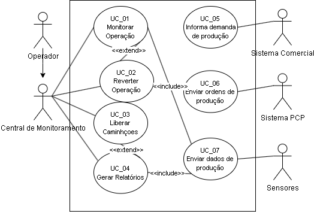

## 📝 Casos de Uso Detalhados

Abaixo, detalhamos cada caso de uso, mostrando o fluxo principal, fluxos alternativos, pré-condições e pós-condições.

### UC_01 - Monitorar Operação

Clique para expandir

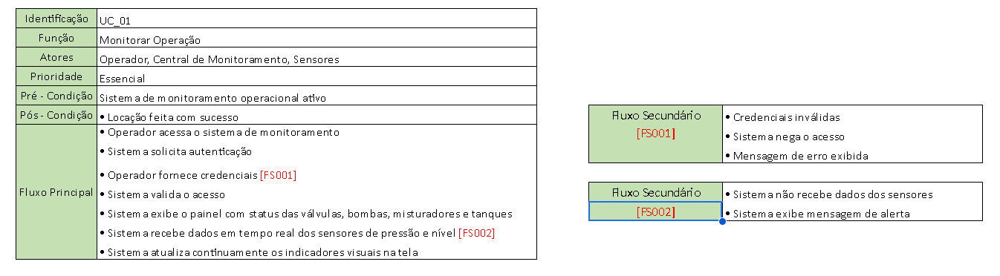

### UC_02 - Reverter Operação

Clique para expandir

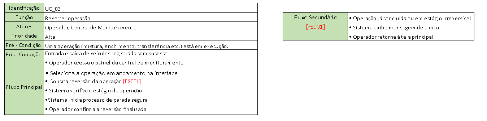

### UC_03 - Liberar Caminhões

Clique para expandir

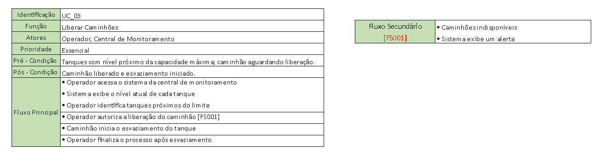

### UC_04 - Gerar Relatórios

Clique para expandir

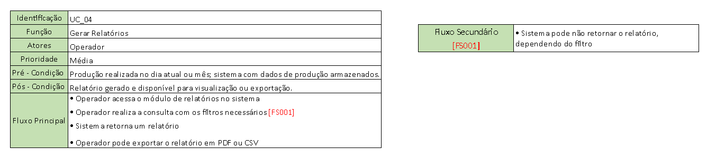

### UC_05 - Informar demanda de Produção

Clique para expandir

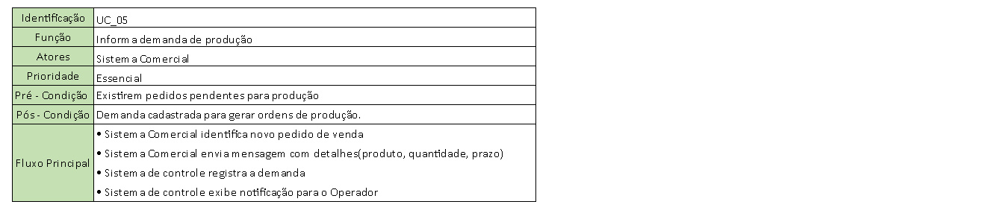

### UC_06 - UC_06 - Enviar ordens de produção

Clique para expandir

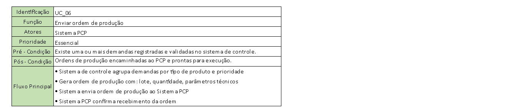

### UC_07 - Enviar dados de produção

Clique para expandir

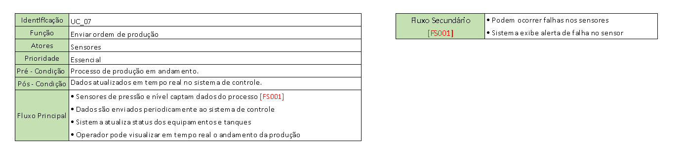

## 🧮 Diagrama de Classes

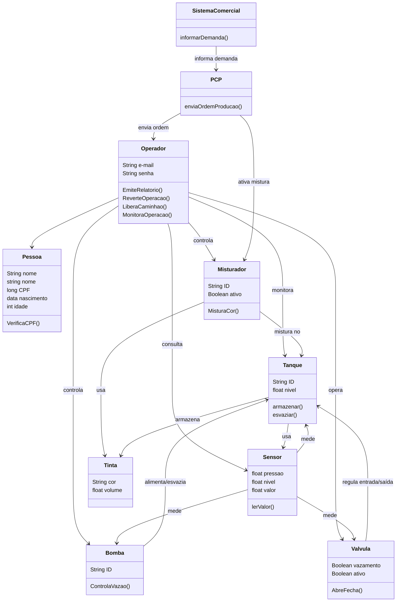
``` mermaid

classDiagram

    Operador --> Pessoa

    Operador --> Misturador : controla
    Operador --> Tanque : monitora
    Operador --> Valvula : opera
    Operador --> Bomba : controla
    Operador --> Sensor : consulta

    Misturador --> Tanque : mistura no
    Misturador --> Tinta : usa

    Tanque --> Tinta : armazena
    Tanque --> Sensor : usa

    Bomba --> Tanque : alimenta/esvazia
    Valvula --> Tanque : regula entrada/saída

    Sensor --> Tanque : mede
    Sensor --> Bomba : mede
    Sensor --> Valvula : mede

    PCP --> Operador : envia ordem
    PCP --> Misturador : ativa mistura

    SistemaComercial --> PCP : informa demanda

    class Pessoa {
        String nome
        string nome
        long CPF
        data nascimento
        int idade
        VerificaCPF()
    }

    class Operador{
        String e-mail
        String senha
        EmiteRelatorio()
        ReverteOperacao()
        LiberaCaminhao()
        MonitoraOperacao()
    }

    class Misturador {
        String ID
        Boolean ativo
        MisturaCor()
    }

    class Bomba {
        String ID
        ControlaVazao()
    }

    class Valvula {
        Boolean vazamento
        Boolean ativo
        AbreFecha()
    }

    class Tanque {
        String ID
        float nivel
        armazenar()
        esvaziar()
    }

    class Sensor {
        float pressao
        float nivel
        float valor
        lerValor()
    }

    class Tinta {
        String cor
        float volume
    }

    class PCP {
        enviaOrdemProducao()
    }

    class SistemaComercial {
        informarDemanda()
    }
```

## 📌 Diagrama de Sequência

1. Monitorar Operação
2. Reverter Operação
3. Liberar Caminhões
4. Gerar Relatórios
5. Informar Demanda de Produção
6. Enviar ordens de produção
7. Enviar dados de produção

### 1️⃣ Operador que Monitorar Operação

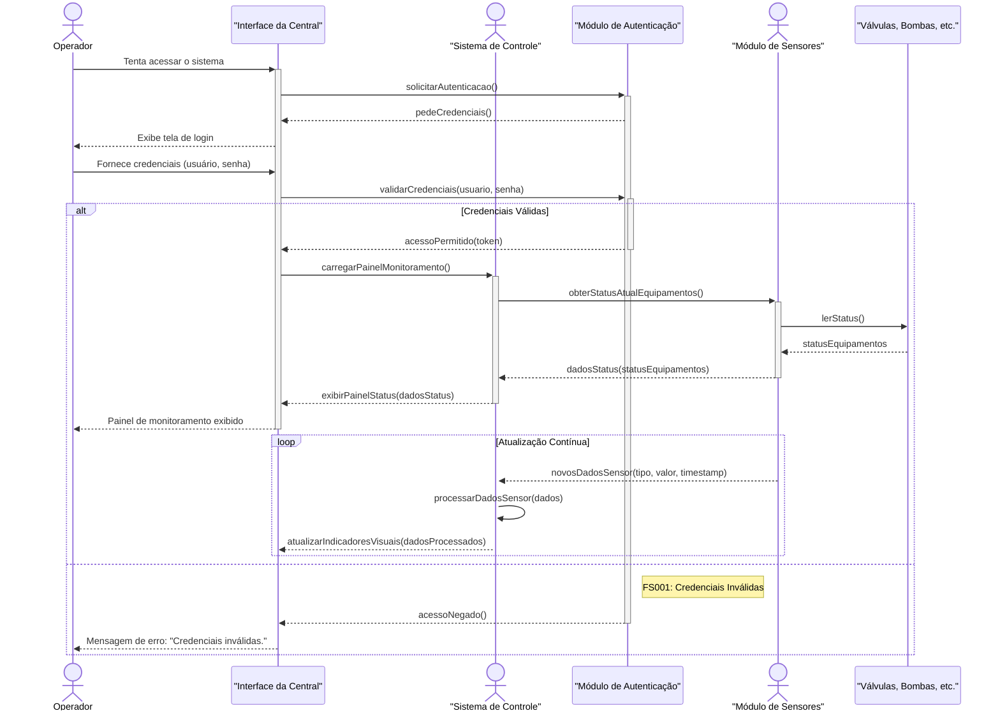
```mermaid
sequenceDiagram
  actor Operador as Operador
  participant UI_Central as "Interface da Central"
  actor SistemaControle as "Sistema de Controle"
  participant ModuloAutenticacao as "Módulo de Autenticação"
  actor ModuloSensores as "Módulo de Sensores"
  participant Equipamentos as "Válvulas, Bombas, etc."

  Operador ->>+ UI_Central: Tenta acessar o sistema
  UI_Central ->>+ ModuloAutenticacao: solicitarAutenticacao()
  ModuloAutenticacao -->> UI_Central: pedeCredenciais()
  UI_Central -->> Operador: Exibe tela de login
  Operador ->> UI_Central: Fornece credenciais (usuário, senha)
  UI_Central ->>+ ModuloAutenticacao: validarCredenciais(usuario, senha)
  alt Credenciais Válidas
    ModuloAutenticacao -->>- UI_Central: acessoPermitido(token)
    UI_Central ->>+ SistemaControle: carregarPainelMonitoramento()
    SistemaControle ->>+ ModuloSensores: obterStatusAtualEquipamentos()
    ModuloSensores ->> Equipamentos: lerStatus()
    Equipamentos -->> ModuloSensores: statusEquipamentos
    ModuloSensores -->>- SistemaControle: dadosStatus(statusEquipamentos)
    SistemaControle -->>- UI_Central: exibirPainelStatus(dadosStatus)
    UI_Central -->>- Operador: Painel de monitoramento exibido
    loop Atualização Contínua
      ModuloSensores -->>+ SistemaControle: novosDadosSensor(tipo, valor, timestamp)
      SistemaControle ->> SistemaControle: processarDadosSensor(dados)
      SistemaControle -->> UI_Central: atualizarIndicadoresVisuais(dadosProcessados)
    end
  else
    Note right of ModuloAutenticacao: FS001: Credenciais Inválidas
    ModuloAutenticacao -->>- UI_Central: acessoNegado()
    UI_Central -->> Operador: Mensagem de erro: "Credenciais inválidas."
  end
```
### 2️⃣ Controle das Locações
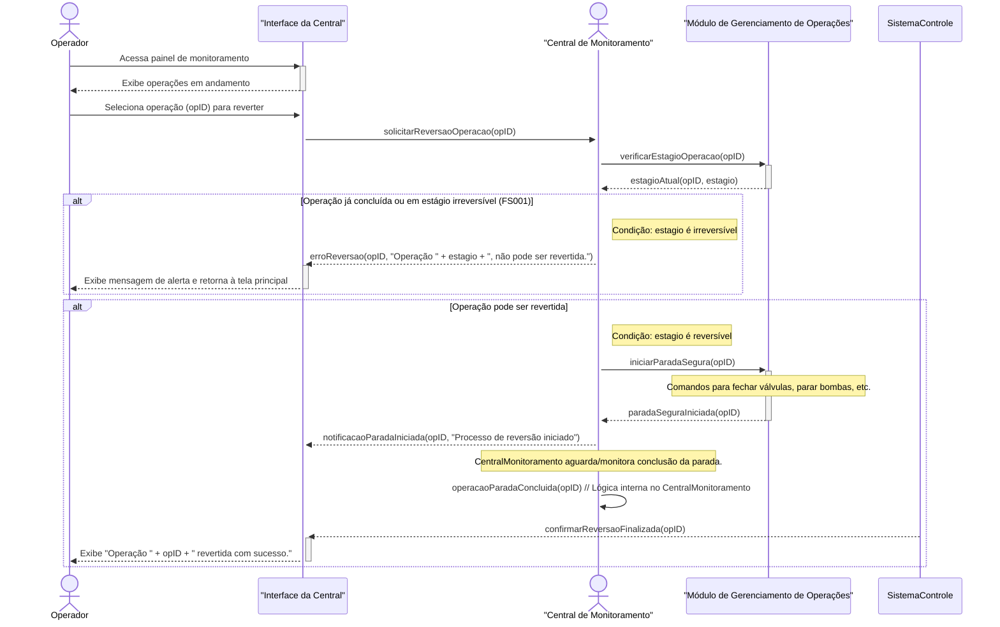
```mermaid
sequenceDiagram
    actor Operador
    participant UI_Central as "Interface da Central"
    actor CentralMonitoramento as "Central de Monitoramento"
    participant ModuloOperacoes as "Módulo de Gerenciamento de Operações"

    Operador->>+UI_Central: Acessa painel de monitoramento
    UI_Central-->>-Operador: Exibe operações em andamento

    Operador->>+UI_Central: Seleciona operação (opID) para reverter
    UI_Central->>+CentralMonitoramento: solicitarReversaoOperacao(opID)

    CentralMonitoramento->>+ModuloOperacoes: verificarEstagioOperacao(opID)
    ModuloOperacoes-->>-CentralMonitoramento: estagioAtual(opID, estagio)

    alt Operação já concluída ou em estágio irreversível (FS001)
        Note right of CentralMonitoramento: Condição: estagio é irreversível
        CentralMonitoramento-->>+UI_Central: erroReversao(opID, "Operação " + estagio + ", não pode ser revertida.")
        UI_Central-->>-Operador: Exibe mensagem de alerta e retorna à tela principal
    end

    alt Operação pode ser revertida
        Note right of CentralMonitoramento: Condição: estagio é reversível
        CentralMonitoramento->>+ModuloOperacoes: iniciarParadaSegura(opID)
        Note over ModuloOperacoes: Comandos para fechar válvulas, parar bombas, etc.
        ModuloOperacoes-->>-CentralMonitoramento: paradaSeguraIniciada(opID)
        CentralMonitoramento-->>+UI_Central: notificacaoParadaIniciada(opID, "Processo de reversão iniciado")

        Note over CentralMonitoramento: CentralMonitoramento aguarda/monitora conclusão da parada.
        CentralMonitoramento->>CentralMonitoramento: operacaoParadaConcluida(opID) // Lógica interna no CentralMonitoramento
        SistemaControle-->>+UI_Central: confirmarReversaoFinalizada(opID)
        UI_Central-->>-Operador: Exibe "Operação " + opID + " revertida com sucesso."
    end
```
### 3️⃣ Liberar Caminhões

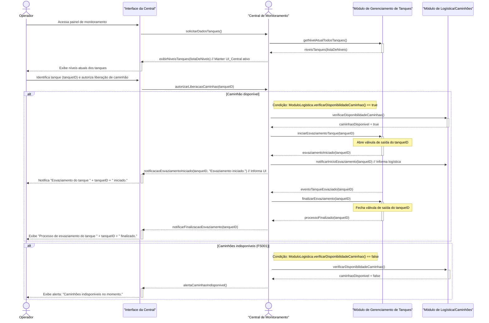
```mermaid
sequenceDiagram
    actor Operador
    participant UI_Central as "Interface da Central"
    actor CentralMonitoramento as "Central de Monitoramento"
    participant ModuloTanques as "Módulo de Gerenciamento de Tanques"
    participant ModuloLogistica as "Módulo de Logística/Caminhões"

    Operador->>+UI_Central: Acessa painel de monitoramento
    UI_Central->>+CentralMonitoramento: solicitarDadosTanques()
    CentralMonitoramento->>+ModuloTanques: getNivelAtualTodosTanques()
    ModuloTanques-->>-CentralMonitoramento: niveisTanques(listaDeNiveis)
    CentralMonitoramento-->>+UI_Central: exibirNiveisTanques(listaDeNiveis) // Manter UI_Central ativo
    UI_Central-->>-Operador: Exibe níveis atuais dos tanques

    Operador->>+UI_Central: Identifica tanque (tanqueID) e autoriza liberação de caminhão
    UI_Central->>+CentralMonitoramento: autorizarLiberacaoCaminhao(tanqueID)

    alt Caminhão disponível
        Note right of CentralMonitoramento: Condição: ModuloLogistica.verificarDisponibilidadeCaminhao() == true
        CentralMonitoramento->>+ModuloLogistica: verificarDisponibilidadeCaminhao()
        ModuloLogistica-->>-CentralMonitoramento: caminhaoDisponivel = true
        CentralMonitoramento->>+ModuloTanques: iniciarEsvaziamentoTanque(tanqueID)
        Note over ModuloTanques: Abre válvula de saída do tanqueID
        ModuloTanques-->>-CentralMonitoramento: esvaziamentoIniciado(tanqueID)
        CentralMonitoramento->>+ModuloLogistica: notificarInicioEsvaziamento(tanqueID) // Informa logística
        CentralMonitoramento-->>+UI_Central: notificacaoEsvaziamentoIniciado(tanqueID, "Esvaziamento iniciado.") // Informa UI
        UI_Central-->>-Operador: Notifica "Esvaziamento do tanque " + tanqueID + " iniciado."

        ModuloTanques-->>+CentralMonitoramento: eventoTanqueEsvaziado(tanqueID)
        CentralMonitoramento->>+ModuloTanques: finalizarEsvaziamento(tanqueID)
        Note over ModuloTanques: Fecha válvula de saída do tanqueID
        ModuloTanques-->>-CentralMonitoramento: processoFinalizado(tanqueID)
        CentralMonitoramento-->>+UI_Central: notificarFinalizacaoEsvaziamento(tanqueID)
        UI_Central-->>-Operador: Exibe "Processo de esvaziamento do tanque " + tanqueID + " finalizado."
    end

    alt Caminhões indisponíveis (FS001)
        Note right of CentralMonitoramento: Condição: ModuloLogistica.verificarDisponibilidadeCaminhao() == false

        CentralMonitoramento->>+ModuloLogistica: verificarDisponibilidadeCaminhao()
        ModuloLogistica-->>-CentralMonitoramento: caminhaoDisponivel = false
        CentralMonitoramento-->>+UI_Central: alertaCaminhaoIndisponivel()
        UI_Central-->>-Operador: Exibe alerta: "Caminhões indisponíveis no momento."
    end
```
### 4️⃣ Gerar Relatório

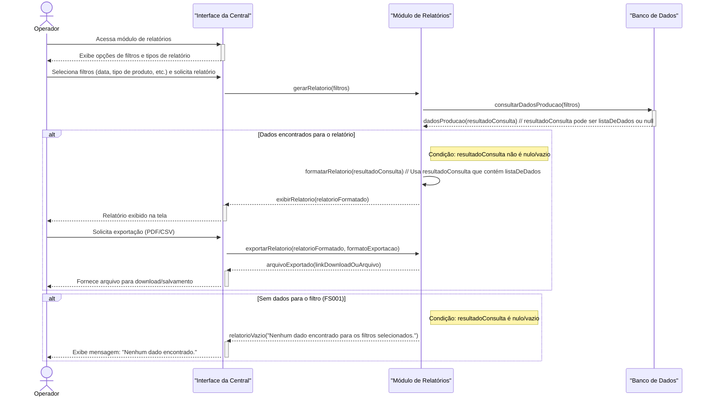
```mermaid
sequenceDiagram
    actor Operador
    participant UI_Central as "Interface da Central"
    participant ModuloRelatorios as "Módulo de Relatórios"
    participant BancoDeDados as "Banco de Dados"

    Operador->>+UI_Central: Acessa módulo de relatórios
    UI_Central-->>-Operador: Exibe opções de filtros e tipos de relatório

    Operador->>+UI_Central: Seleciona filtros (data, tipo de produto, etc.) e solicita relatório
    UI_Central->>+ModuloRelatorios: gerarRelatorio(filtros)

    ModuloRelatorios->>+BancoDeDados: consultarDadosProducao(filtros)
    BancoDeDados-->>-ModuloRelatorios: dadosProducao(resultadoConsulta) // resultadoConsulta pode ser listaDeDados ou null

    alt Dados encontrados para o relatório
        Note right of ModuloRelatorios: Condição: resultadoConsulta não é nulo/vazio
        ModuloRelatorios->>ModuloRelatorios: formatarRelatorio(resultadoConsulta) // Usa resultadoConsulta que contém listaDeDados
        ModuloRelatorios-->>+UI_Central: exibirRelatorio(relatorioFormatado)
        UI_Central-->>-Operador: Relatório exibido na tela

        Operador->>+UI_Central: Solicita exportação (PDF/CSV)
        UI_Central->>+ModuloRelatorios: exportarRelatorio(relatorioFormatado, formatoExportacao)
        ModuloRelatorios-->>+UI_Central: arquivoExportado(linkDownloadOuArquivo)
        UI_Central-->>-Operador: Fornece arquivo para download/salvamento
    end

    alt Sem dados para o filtro (FS001)
        Note right of ModuloRelatorios: Condição: resultadoConsulta é nulo/vazio
        ModuloRelatorios-->>+UI_Central: relatorioVazio("Nenhum dado encontrado para os filtros selecionados.")
        UI_Central-->>-Operador: Exibe mensagem: "Nenhum dado encontrado."
    end
```

### 5️⃣ Informar Demanda de Produção
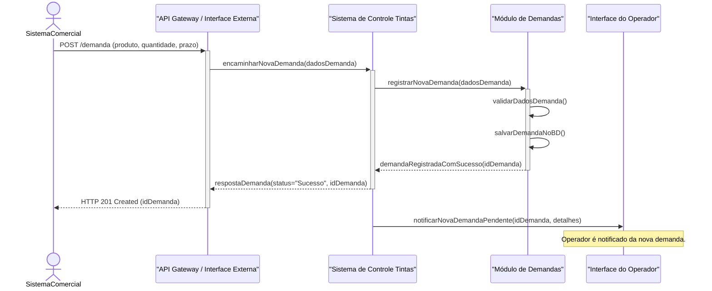
```mermaid
sequenceDiagram
    actor SistemaComercial
    participant APIGateway as "API Gateway / Interface Externa"
    participant SistemaControle as "Sistema de Controle Tintas"
    participant ModuloDemandas as "Módulo de Demandas"
    participant UI_Central_Operador as "Interface do Operador"

    SistemaComercial->>+APIGateway: POST /demanda (produto, quantidade, prazo)
    APIGateway->>+SistemaControle: encaminharNovaDemanda(dadosDemanda)
    SistemaControle->>+ModuloDemandas: registrarNovaDemanda(dadosDemanda)
    ModuloDemandas->>ModuloDemandas: validarDadosDemanda()
    ModuloDemandas->>ModuloDemandas: salvarDemandaNoBD()
    ModuloDemandas-->>-SistemaControle: demandaRegistradaComSucesso(idDemanda)
    SistemaControle-->>-APIGateway: respostaDemanda(status="Sucesso", idDemanda)
    APIGateway-->>-SistemaComercial: HTTP 201 Created (idDemanda)

    SistemaControle->>UI_Central_Operador: notificarNovaDemandaPendente(idDemanda, detalhes)
    Note over UI_Central_Operador: Operador é notificado da nova demanda.
```
### 6️⃣ Enviar Ordens de Produção
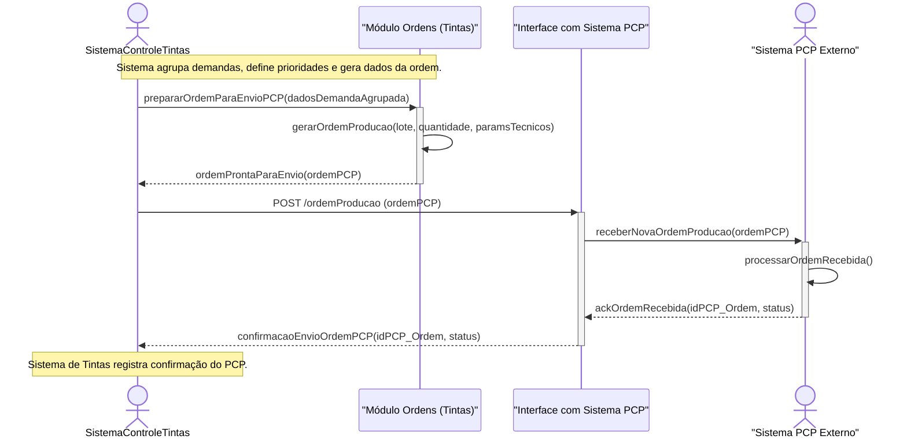
```mermaid
sequenceDiagram
    actor SistemaControleTintas
    participant ModuloOrdensProducao_Tintas as "Módulo Ordens (Tintas)"
    participant APIGateway_PCP as "Interface com Sistema PCP"
    actor SistemaPCP_Externo as "Sistema PCP Externo"

    Note over SistemaControleTintas, ModuloOrdensProducao_Tintas: Sistema agrupa demandas, define prioridades e gera dados da ordem.

    SistemaControleTintas->>+ModuloOrdensProducao_Tintas: prepararOrdemParaEnvioPCP(dadosDemandaAgrupada)
    ModuloOrdensProducao_Tintas->>ModuloOrdensProducao_Tintas: gerarOrdemProducao(lote, quantidade, paramsTecnicos)
    ModuloOrdensProducao_Tintas-->>-SistemaControleTintas: ordemProntaParaEnvio(ordemPCP)

    SistemaControleTintas->>+APIGateway_PCP: POST /ordemProducao (ordemPCP)
    APIGateway_PCP->>+SistemaPCP_Externo: receberNovaOrdemProducao(ordemPCP)
    SistemaPCP_Externo->>SistemaPCP_Externo: processarOrdemRecebida()
    SistemaPCP_Externo-->>-APIGateway_PCP: ackOrdemRecebida(idPCP_Ordem, status)
    APIGateway_PCP-->>-SistemaControleTintas: confirmacaoEnvioOrdemPCP(idPCP_Ordem, status)

    Note over SistemaControleTintas: Sistema de Tintas registra confirmação do PCP.
```
### 7️⃣ Enviar Dados de Produção
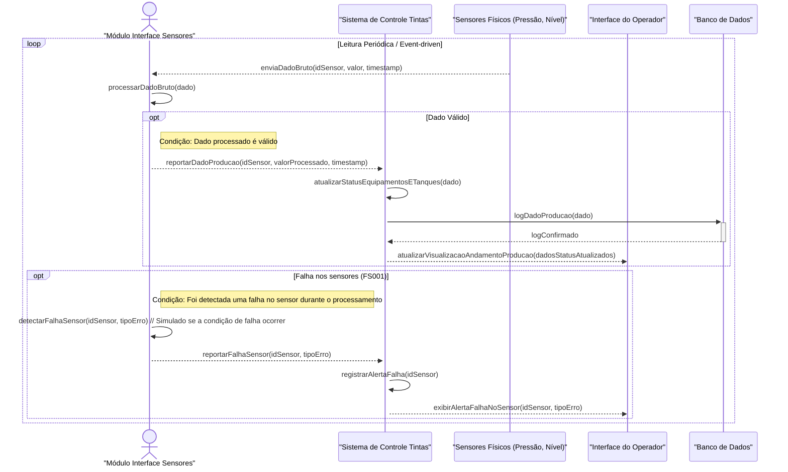
```mermaid
sequenceDiagram
    actor ModuloSensores as "Módulo Interface Sensores"
    participant SistemaControle as "Sistema de Controle Tintas"
    participant EquipamentosHardware as "Sensores Físicos (Pressão, Nível)"
    participant UI_Central_Operador as "Interface do Operador"
    participant BancoDeDados as "Banco de Dados"

    loop Leitura Periódica / Event-driven
        EquipamentosHardware-->>+ModuloSensores: enviaDadoBruto(idSensor, valor, timestamp)
        ModuloSensores->>ModuloSensores: processarDadoBruto(dado)

        opt Dado Válido
            Note right of ModuloSensores: Condição: Dado processado é válido
            ModuloSensores-->>+SistemaControle: reportarDadoProducao(idSensor, valorProcessado, timestamp)
            SistemaControle->>SistemaControle: atualizarStatusEquipamentosETanques(dado)
            SistemaControle->>+BancoDeDados: logDadoProducao(dado)
            BancoDeDados-->>-SistemaControle: logConfirmado
            SistemaControle-->>UI_Central_Operador: atualizarVisualizacaoAndamentoProducao(dadosStatusAtualizados)
        end

        opt Falha nos sensores (FS001)
            Note right of ModuloSensores: Condição: Foi detectada uma falha no sensor durante o processamento
            ModuloSensores->>ModuloSensores: detectarFalhaSensor(idSensor, tipoErro) // Simulado se a condição de falha ocorrer
            ModuloSensores-->>+SistemaControle: reportarFalhaSensor(idSensor, tipoErro)
            SistemaControle->>SistemaControle: registrarAlertaFalha(idSensor)
            SistemaControle-->>UI_Central_Operador: exibirAlertaFalhaNoSensor(idSensor, tipoErro)
        end
    end
```
### 1️⃣ Operador
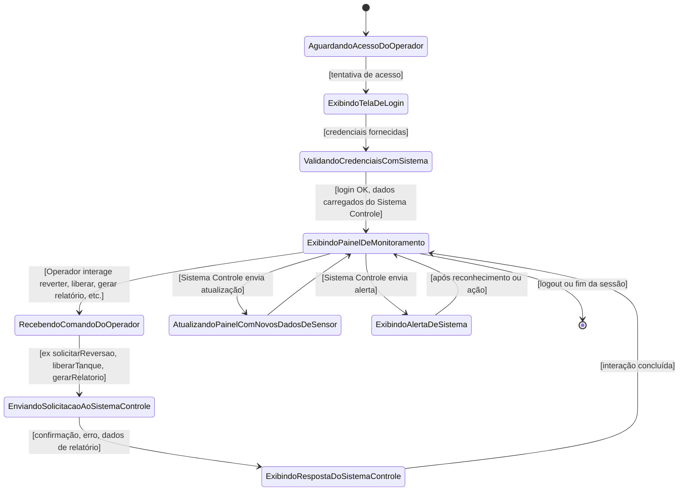
```mermaid
stateDiagram-v2

    [*] --> AguardandoAcessoDoOperador
    AguardandoAcessoDoOperador --> ExibindoTelaDeLogin : [tentativa de acesso]
    ExibindoTelaDeLogin --> ValidandoCredenciaisComSistema : [credenciais fornecidas]
    ValidandoCredenciaisComSistema --> ExibindoPainelDeMonitoramento : [login OK, dados carregados do Sistema Controle]
    ExibindoPainelDeMonitoramento --> RecebendoComandoDoOperador : [Operador interage reverter, liberar, gerar relatório, etc.]
    ExibindoPainelDeMonitoramento --> AtualizandoPainelComNovosDadosDeSensor : [Sistema Controle envia atualização]
    ExibindoPainelDeMonitoramento --> ExibindoAlertaDeSistema : [Sistema Controle envia alerta]

    RecebendoComandoDoOperador --> EnviandoSolicitacaoAoSistemaControle : [ex solicitarReversao, liberarTanque, gerarRelatorio]
    EnviandoSolicitacaoAoSistemaControle --> ExibindoRespostaDoSistemaControle : [confirmação, erro, dados de relatório]
    ExibindoRespostaDoSistemaControle --> ExibindoPainelDeMonitoramento : [interação concluída]

    AtualizandoPainelComNovosDadosDeSensor --> ExibindoPainelDeMonitoramento
    ExibindoAlertaDeSistema --> ExibindoPainelDeMonitoramento : [após reconhecimento ou ação]
    ExibindoPainelDeMonitoramento --> [*] : [logout ou fim da sessão]
```
### 2️⃣ Sistema PCP
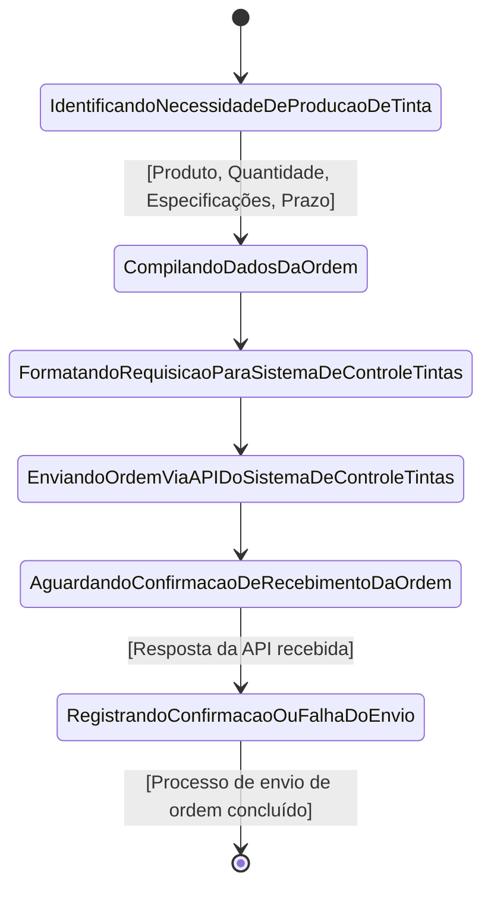
```mermaid
stateDiagram-v2
    [*] --> IdentificandoNecessidadeDeProducaoDeTinta
    IdentificandoNecessidadeDeProducaoDeTinta --> CompilandoDadosDaOrdem : [Produto, Quantidade, Especificações, Prazo]
    CompilandoDadosDaOrdem --> FormatandoRequisicaoParaSistemaDeControleTintas
    FormatandoRequisicaoParaSistemaDeControleTintas --> EnviandoOrdemViaAPIDoSistemaDeControleTintas
    EnviandoOrdemViaAPIDoSistemaDeControleTintas --> AguardandoConfirmacaoDeRecebimentoDaOrdem
    AguardandoConfirmacaoDeRecebimentoDaOrdem --> RegistrandoConfirmacaoOuFalhaDoEnvio : [Resposta da API recebida]
    RegistrandoConfirmacaoOuFalhaDoEnvio --> [*] : [Processo de envio de ordem concluído]
```
### 3️⃣ Central de Monitoramento
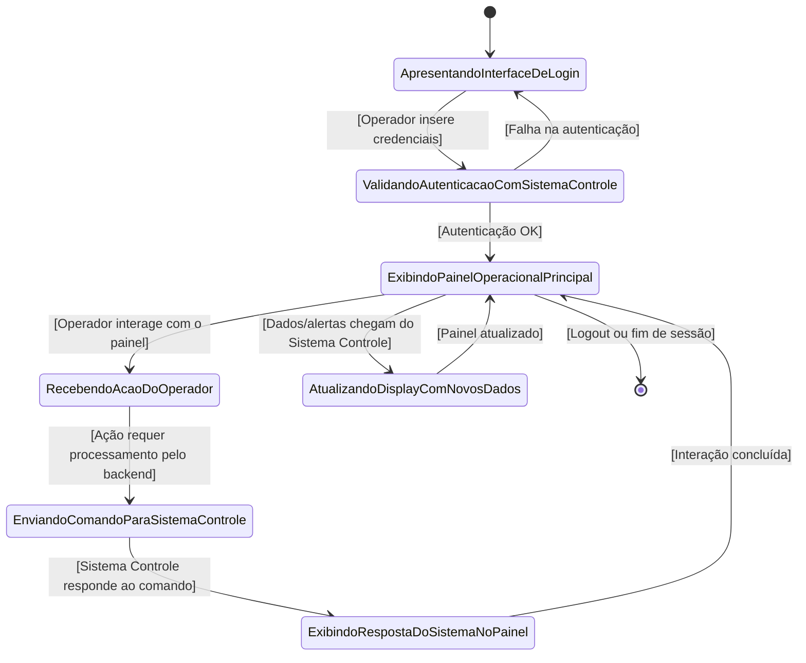
```mermaid
stateDiagram-v2

    [*] --> ApresentandoInterfaceDeLogin
    ApresentandoInterfaceDeLogin --> ValidandoAutenticacaoComSistemaControle : [Operador insere credenciais]
    ValidandoAutenticacaoComSistemaControle --> ExibindoPainelOperacionalPrincipal : [Autenticação OK]
    ValidandoAutenticacaoComSistemaControle --> ApresentandoInterfaceDeLogin : [Falha na autenticação]

    ExibindoPainelOperacionalPrincipal --> RecebendoAcaoDoOperador : [Operador interage com o painel]
    ExibindoPainelOperacionalPrincipal --> AtualizandoDisplayComNovosDados : [Dados/alertas chegam do Sistema Controle]

    RecebendoAcaoDoOperador --> EnviandoComandoParaSistemaControle : [Ação requer processamento pelo backend]
    EnviandoComandoParaSistemaControle --> ExibindoRespostaDoSistemaNoPainel : [Sistema Controle responde ao comando]
    ExibindoRespostaDoSistemaNoPainel --> ExibindoPainelOperacionalPrincipal : [Interação concluída]

    AtualizandoDisplayComNovosDados --> ExibindoPainelOperacionalPrincipal : [Painel atualizado]

    ExibindoPainelOperacionalPrincipal --> [*] : [Logout ou fim de sessão]
```
### 4️⃣ Sistema Comercial
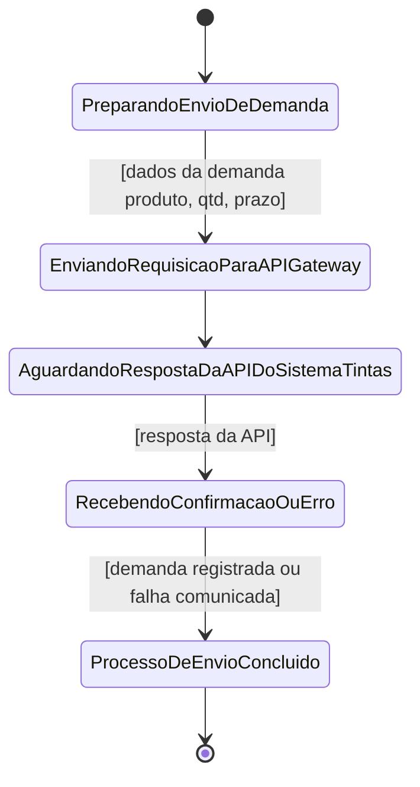
```mermaid
stateDiagram-v2
    [*] --> PreparandoEnvioDeDemanda
    PreparandoEnvioDeDemanda --> EnviandoRequisicaoParaAPIGateway : [dados da demanda produto, qtd, prazo]
    EnviandoRequisicaoParaAPIGateway --> AguardandoRespostaDaAPIDoSistemaTintas
    AguardandoRespostaDaAPIDoSistemaTintas --> RecebendoConfirmacaoOuErro : [resposta da API]
    RecebendoConfirmacaoOuErro --> ProcessoDeEnvioConcluido : [demanda registrada ou falha comunicada]
    ProcessoDeEnvioConcluido --> [*]
```
### 5️⃣ Sistema Controle Tintas
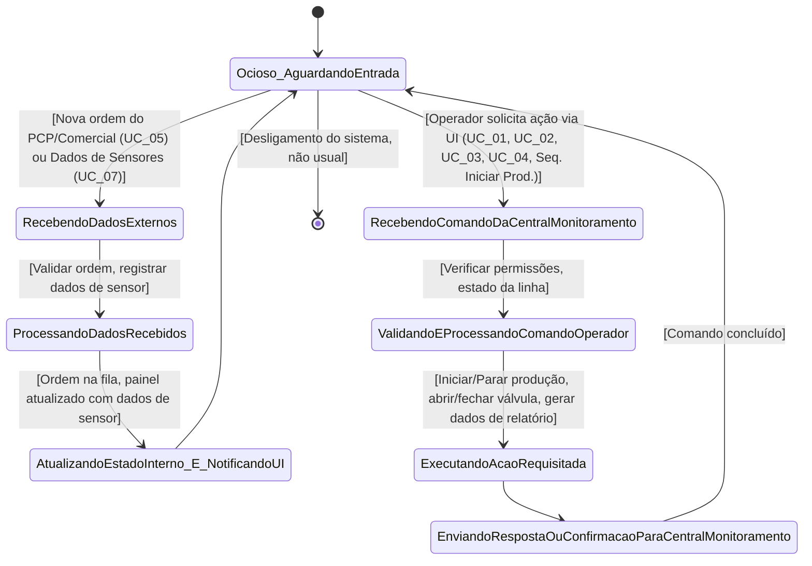
```mermaid
stateDiagram-v2
    [*] --> Ocioso_AguardandoEntrada

    Ocioso_AguardandoEntrada --> RecebendoDadosExternos : [Nova ordem do PCP/Comercial (UC_05) ou Dados de Sensores (UC_07)]
    Ocioso_AguardandoEntrada --> RecebendoComandoDaCentralMonitoramento : [Operador solicita ação via UI (UC_01, UC_02, UC_03, UC_04, Seq. Iniciar Prod.)]

    RecebendoDadosExternos --> ProcessandoDadosRecebidos : [Validar ordem, registrar dados de sensor]
    ProcessandoDadosRecebidos --> AtualizandoEstadoInterno_E_NotificandoUI : [Ordem na fila, painel atualizado com dados de sensor]
    AtualizandoEstadoInterno_E_NotificandoUI --> Ocioso_AguardandoEntrada

    RecebendoComandoDaCentralMonitoramento --> ValidandoEProcessandoComandoOperador : [Verificar permissões, estado da linha]
    ValidandoEProcessandoComandoOperador --> ExecutandoAcaoRequisitada : [Iniciar/Parar produção, abrir/fechar válvula, gerar dados de relatório]
    ExecutandoAcaoRequisitada --> EnviandoRespostaOuConfirmacaoParaCentralMonitoramento
    EnviandoRespostaOuConfirmacaoParaCentralMonitoramento --> Ocioso_AguardandoEntrada : [Comando concluído]

    Ocioso_AguardandoEntrada --> [*] : [Desligamento do sistema, não usual]
```

### 6️⃣ Módulo Interface Sensores
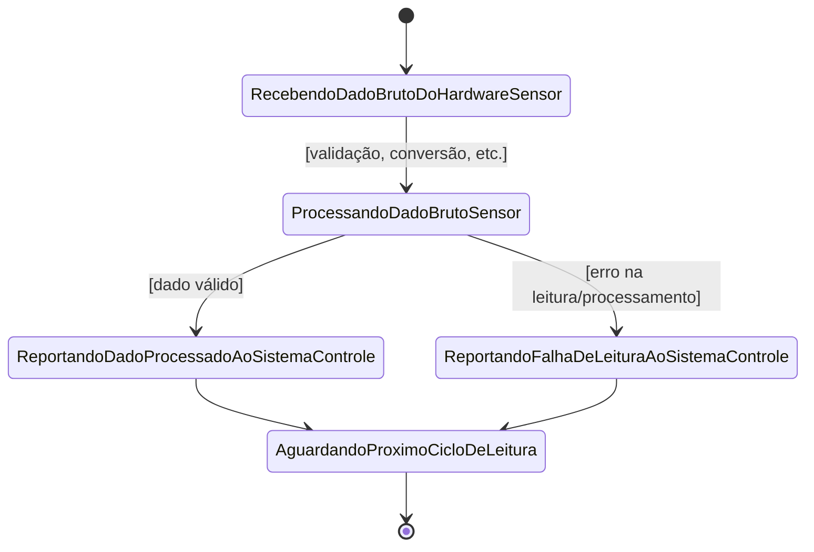
```mermaid
stateDiagram-v2
    [*] --> RecebendoDadoBrutoDoHardwareSensor
    RecebendoDadoBrutoDoHardwareSensor --> ProcessandoDadoBrutoSensor : [validação, conversão, etc.]
    ProcessandoDadoBrutoSensor --> ReportandoDadoProcessadoAoSistemaControle : [dado válido]
    ProcessandoDadoBrutoSensor --> ReportandoFalhaDeLeituraAoSistemaControle : [erro na leitura/processamento]
    ReportandoDadoProcessadoAoSistemaControle --> AguardandoProximoCicloDeLeitura
    ReportandoFalhaDeLeituraAoSistemaControle --> AguardandoProximoCicloDeLeitura
    AguardandoProximoCicloDeLeitura --> [*]
```
## 🎱 Diagramas de Atividades
### Interface de Produção
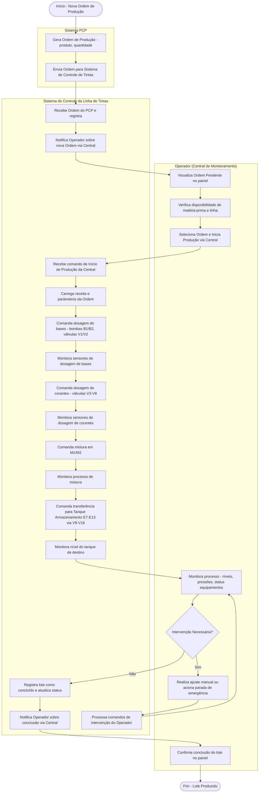
```mermaid
graph TD
    start([Início - Nova Ordem de Produção])

    subgraph "Sistema PCP"
        pcpA1[Gera Ordem de Produção - produto, quantidade]
        pcpA2[Envia Ordem para Sistema de Controle de Tintas]
    end

    subgraph "Operador (Central de Monitoramento)"
        opB1[Visualiza Ordem Pendente no painel]
        opB2[Verifica disponibilidade de matéria-prima e linha]
        opB3[Seleciona Ordem e Inicia Produção via Central]
        opB4[Monitora processo - níveis, pressões, status equipamentos]
        opB5{"Intervenção Necessária?"}
        opB6[Realiza ajuste manual ou aciona parada de emergência]
        opB7[Confirma conclusão do lote no painel]
    end

    subgraph "Sistema de Controle da Linha de Tintas"
        sysC1[Recebe Ordem do PCP e registra]
        sysC2[Notifica Operador sobre nova Ordem via Central]
        sysC3[Recebe comando de Início de Produção da Central]
        sysC4[Carrega receita e parâmetros da Ordem]
        sysC5[Comanda dosagem de bases - bombas B1/B2, válvulas V1/V2]
        sysC6[Monitora sensores de dosagem de bases]
        sysC7[Comanda dosagem de corantes - válvulas V3-V8]
        sysC8[Monitora sensores de dosagem de corantes]
        sysC9[Comanda mistura em M1/M2]
        sysC10[Monitora processo de mistura]
        sysC11[Comanda transferência para Tanque Armazenamento E7-E13 via V9-V16]
        sysC12[Monitora nível do tanque de destino]
        sysC13[Registra lote como concluído e atualiza status]
        sysC14[Notifica Operador sobre conclusão via Central]
        sysC15[Processa comandos de intervenção do Operador]
    end

    start --> pcpA1
    pcpA1 --> pcpA2
    pcpA2 --> sysC1
    sysC1 --> sysC2
    sysC2 --> opB1
    opB1 --> opB2
    opB2 --> opB3
    opB3 --> sysC3
    sysC3 --> sysC4
    sysC4 --> sysC5
    sysC5 --> sysC6
    sysC6 --> sysC7
    sysC7 --> sysC8
    sysC8 --> sysC9
    sysC9 --> sysC10
    sysC10 --> sysC11
    sysC11 --> sysC12
    sysC12 --> opB4
    opB4 --> opB5
    opB5 -- Sim --> opB6
    opB6 --> sysC15
    sysC15 --> opB4
    opB5 -- Não --> sysC13
    sysC13 --> sysC14
    sysC14 --> opB7
    opB7 --> end_producao([Fim - Lote Produzido])
```
### Processo de esvaziation

```mermaid
graph TD
    start_esvaziamento([Início - Necessidade de Esvaziar Tanque])

    subgraph "Operador (Central de Monitoramento)"
        opD1[Identifica Tanque com produto pronto para esvaziar]
        opD2[Verifica se caminhão está posicionado/disponível]
        opD3[Comanda Liberação do Tanque para Esvaziamento via Central]
        opD4[Monitora nível do tanque durante esvaziamento]
        opD5[Confirma finalização do esvaziamento ou interrupção]
    end

    subgraph "Sistema de Controle da Linha de Tintas"
        sysE1[Recebe comando de Liberação de Tanque da Central]
        sysE2[Verifica status do tanque - nível, tipo de produto]
        sysE3[Comanda abertura da válvula de saída do tanque selecionado]
        sysE4[Envia dados de nível do tanque para Central de Monitoramento]
        sysE5{"Tanque Vazio ou Caminhão Cheio?"}
        sysE6[Comanda fechamento da válvula de saída do tanque]
        sysE7[Registra esvaziamento e atualiza status do tanque]
        sysE8[Notifica Central sobre finalização/status]
    end

    subgraph "Logística/Caminhão (Entidade Externa)"
        logF1[Caminhão se posiciona para carregamento]
        logF2[Inicia recebimento de tinta]
        logF3[Sinaliza que está cheio ou que o tanque esvaziou]
    end

    start_esvaziamento --> opD1
    opD1 --> opD2
    opD2 --> logF1
    logF1 --> opD3
    opD3 --> sysE1
    sysE1 --> sysE2
    sysE2 --> sysE3
    sysE3 --> logF2
    logF2 --> opD4
    sysE3 --> sysE4
    sysE4 --> opD4
    opD4 --> sysE5
    sysE5 -- Sim --> sysE6
    sysE6 --> sysE7
    sysE7 --> sysE8
    sysE8 --> opD5
    logF3 --> opD5
    opD5 --> end_esvaziado([Fim - Esvaziamento Concluído/Interrompido])
```

## 🖥️ Diagramas de Componentes e Integração
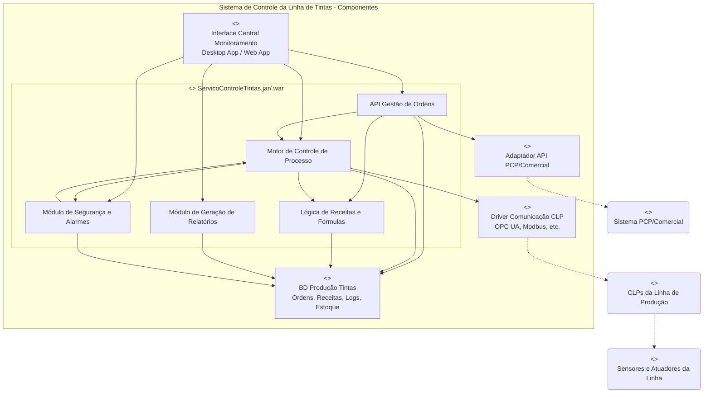
```mermaid
graph TD
    subgraph "Sistema de Controle da Linha de Tintas - Componentes"
        %% Aplicações de Interface
        CentralMonitoramento_UI[<<application>><br>Interface Central Monitoramento<br>Desktop App / Web App]

        %% Núcleo do Sistema de Controle (Backend)
        subgraph "<<service>> ServicoControleTintas.jar/.war"
            direction LR
            APIGestaoOrdens[API Gestão de Ordens]
            MotorControleProcesso[Motor de Controle de Processo]
            LogicaReceitasFormulas[Lógica de Receitas e Fórmulas]
            ModuloRelatorios[Módulo de Geração de Relatórios]
            ModuloSegurancaAlarmes[Módulo de Segurança e Alarmes]
        end

        %% Componentes de Integração e Drivers
        IntegracaoPCP_Comercial[<<component>><br>Adaptador API PCP/Comercial]
        DriverComunicacaoCLP[<<component>><br>Driver Comunicação CLP<br>OPC UA, Modbus, etc.]

        %% Persistência
        BancoDeDadosProducao[<<database>><br>BD Produção Tintas<br>Ordens, Receitas, Logs, Estoque]

        %% Dependências Internas
        CentralMonitoramento_UI --> APIGestaoOrdens
        CentralMonitoramento_UI --> MotorControleProcesso
        %% Para comandos manuais e visualização
        CentralMonitoramento_UI --> ModuloRelatorios
        CentralMonitoramento_UI --> ModuloSegurancaAlarmes

        APIGestaoOrdens --> LogicaReceitasFormulas
        APIGestaoOrdens --> MotorControleProcesso
        APIGestaoOrdens --> BancoDeDadosProducao

        MotorControleProcesso --> LogicaReceitasFormulas
        MotorControleProcesso --> DriverComunicacaoCLP
        %% Comanda os CLPs
        MotorControleProcesso --> ModuloSegurancaAlarmes
        MotorControleProcesso --> BancoDeDadosProducao
        %% Para log de eventos de processo

        LogicaReceitasFormulas --> BancoDeDadosProducao
        ModuloRelatorios --> BancoDeDadosProducao
        ModuloSegurancaAlarmes --> BancoDeDadosProducao
        ModuloSegurancaAlarmes --> MotorControleProcesso
        %% Pode enviar comandos de parada

        %% Dependências com Interfaces Externas
        APIGestaoOrdens --> IntegracaoPCP_Comercial
        %% Para receber ordens e talvez enviar status

    end

    %% Sistemas Externos
    CLPs_LinhaProducao("<<hardware>><br>CLPs da Linha de Produção")
    SistemaPCP_Externo("<<external_system>><br>Sistema PCP/Comercial")
    SensoresAtuadores("<<hardware>><br>Sensores e Atuadores da Linha")

    %% Conexões com Sistemas Externos
    DriverComunicacaoCLP -.-> CLPs_LinhaProducao
    IntegracaoPCP_Comercial -.-> SistemaPCP_Externo
    CLPs_LinhaProducao -.-> SensoresAtuadores
    %% CLPs leem sensores e comandam atuadores
```
## 🛠️ Tecnologias

*   **Diagramas:** 
*   **Diagramas de Caso de Uso:** 
*   **Diagramas de Classes:** 
*   **Diagrama de Sequência:** 

---

## 🤝 Contribuições
Contribuições para aprimorar este projeto são muito bem-vindas, forke o projeto e contribua!

## ✉️ Contato
Qualquer dúvida sobre o projeto entrar em contato, será um prazer!
