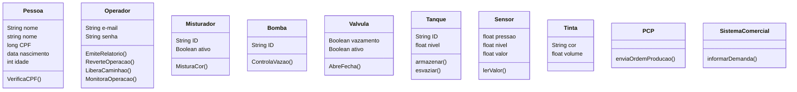

# 🖌️🎨  Indústria de Tintas : Sistema de Gestão de Produção

## 🌟 Equipe de Desenvolvimento

Uma equipe dedicada a transformar o controle de locações da VL!

*   **Bruno Basso** ➔ 22.123.067-5
*   **Gabriel Balbine** ➔ 22.222.001-4
*   **Gabriela Ciocci** ➔ 22.222.032-9
*   **Guilherme Albuquerque** ➔ 22.224.024-4

---

## 📖 Sobre o Projeto

Uma indústria de produção em massa de tintas, nos contratou para modernizar sua gestão!  Atualmente, a empresa opera com processos manuais e registros em fichas.  Nosso desafio é criar um sistema que automatize e otimize todas as etapas da produção.

## 🚀 Diagrama de Casos de Uso

Este diagrama mostra as principais funcionalidades do sistema e como os diferentes atores interagem com ele:

## 📝 Casos de Uso Detalhados

Abaixo, detalhamos cada caso de uso, mostrando o fluxo principal, fluxos alternativos, pré-condições e pós-condições.

### UC_01 - Monitorar Operação

Clique para expandir

### UC_02 - Reverter Operação

Clique para expandir

### UC_03 - Liberar Caminhões

Clique para expandir

### UC_04 - Gerar Relatórios

Clique para expandir

### UC_05 - Informar demanda de Produção

Clique para expandir

### UC_06 - UC_06 - Enviar ordens de produção

Clique para expandir

### UC_07 - Enviar dados de produção

Clique para expandir

## 🧮 Diagrama de Classes

## 📌 Diagrama de Sequência

1. Monitorar Operação
2. Reverter Operação
3. Liberar Caminhões
4. Gerar Relatórios
5. Informar Demanda de Produção
6. Enviar ordens de produção
7. Enviar dados de produção

### 1️⃣ Operador que Monitorar Operação

```mermaid
sequenceDiagram
  actor Operador as Operador
  participant UI_Central as "Interface da Central"
  actor SistemaControle as "Sistema de Controle"
  participant ModuloAutenticacao as "Módulo de Autenticação"
  actor ModuloSensores as "Módulo de Sensores"
  participant Equipamentos as "Válvulas, Bombas, etc."

  Operador ->>+ UI_Central: Tenta acessar o sistema
  UI_Central ->>+ ModuloAutenticacao: solicitarAutenticacao()
  ModuloAutenticacao -->> UI_Central: pedeCredenciais()
  UI_Central -->> Operador: Exibe tela de login
  Operador ->> UI_Central: Fornece credenciais (usuário, senha)
  UI_Central ->>+ ModuloAutenticacao: validarCredenciais(usuario, senha)
  alt Credenciais Válidas
    ModuloAutenticacao -->>- UI_Central: acessoPermitido(token)
    UI_Central ->>+ SistemaControle: carregarPainelMonitoramento()
    SistemaControle ->>+ ModuloSensores: obterStatusAtualEquipamentos()
    ModuloSensores ->> Equipamentos: lerStatus()
    Equipamentos -->> ModuloSensores: statusEquipamentos
    ModuloSensores -->>- SistemaControle: dadosStatus(statusEquipamentos)
    SistemaControle -->>- UI_Central: exibirPainelStatus(dadosStatus)
    UI_Central -->>- Operador: Painel de monitoramento exibido
    loop Atualização Contínua
      ModuloSensores -->>+ SistemaControle: novosDadosSensor(tipo, valor, timestamp)
      SistemaControle ->> SistemaControle: processarDadosSensor(dados)
      SistemaControle -->> UI_Central: atualizarIndicadoresVisuais(dadosProcessados)
    end
  else
    Note right of ModuloAutenticacao: FS001: Credenciais Inválidas
    ModuloAutenticacao -->>- UI_Central: acessoNegado()
    UI_Central -->> Operador: Mensagem de erro: "Credenciais inválidas."
  end
```

### 2️⃣ Controle das Locações

```mermaid
sequenceDiagram
    actor Operador
    participant UI_Central as "Interface da Central"
    actor CentralMonitoramento as "Central de Monitoramento"
    participant ModuloOperacoes as "Módulo de Gerenciamento de Operações"

    Operador->>+UI_Central: Acessa painel de monitoramento
    UI_Central-->>-Operador: Exibe operações em andamento

    Operador->>+UI_Central: Seleciona operação (opID) para reverter
    UI_Central->>+CentralMonitoramento: solicitarReversaoOperacao(opID)

    CentralMonitoramento->>+ModuloOperacoes: verificarEstagioOperacao(opID)
    ModuloOperacoes-->>-CentralMonitoramento: estagioAtual(opID, estagio)

    alt Operação já concluída ou em estágio irreversível (FS001)
        Note right of CentralMonitoramento: Condição: estagio é irreversível
        CentralMonitoramento-->>+UI_Central: erroReversao(opID, "Operação " + estagio + ", não pode ser revertida.")
        UI_Central-->>-Operador: Exibe mensagem de alerta e retorna à tela principal
    end

    alt Operação pode ser revertida
        Note right of CentralMonitoramento: Condição: estagio é reversível
        CentralMonitoramento->>+ModuloOperacoes: iniciarParadaSegura(opID)
        Note over ModuloOperacoes: Comandos para fechar válvulas, parar bombas, etc.
        ModuloOperacoes-->>-CentralMonitoramento: paradaSeguraIniciada(opID)
        CentralMonitoramento-->>+UI_Central: notificacaoParadaIniciada(opID, "Processo de reversão iniciado")

        Note over CentralMonitoramento: CentralMonitoramento aguarda/monitora conclusão da parada.
        CentralMonitoramento->>CentralMonitoramento: operacaoParadaConcluida(opID) // Lógica interna no CentralMonitoramento
        SistemaControle-->>+UI_Central: confirmarReversaoFinalizada(opID)
        UI_Central-->>-Operador: Exibe "Operação " + opID + " revertida com sucesso."
    end
```

### 3️⃣ Liberar Caminhões

```mermaid
sequenceDiagram
    actor Operador
    participant UI_Central as "Interface da Central"
    actor CentralMonitoramento as "Central de Monitoramento"
    participant ModuloTanques as "Módulo de Gerenciamento de Tanques"
    participant ModuloLogistica as "Módulo de Logística/Caminhões"

    Operador->>+UI_Central: Acessa painel de monitoramento
    UI_Central->>+CentralMonitoramento: solicitarDadosTanques()
    CentralMonitoramento->>+ModuloTanques: getNivelAtualTodosTanques()
    ModuloTanques-->>-CentralMonitoramento: niveisTanques(listaDeNiveis)
    CentralMonitoramento-->>+UI_Central: exibirNiveisTanques(listaDeNiveis) // Manter UI_Central ativo
    UI_Central-->>-Operador: Exibe níveis atuais dos tanques

    Operador->>+UI_Central: Identifica tanque (tanqueID) e autoriza liberação de caminhão
    UI_Central->>+CentralMonitoramento: autorizarLiberacaoCaminhao(tanqueID)

    alt Caminhão disponível
        Note right of CentralMonitoramento: Condição: ModuloLogistica.verificarDisponibilidadeCaminhao() == true
        CentralMonitoramento->>+ModuloLogistica: verificarDisponibilidadeCaminhao()
        ModuloLogistica-->>-CentralMonitoramento: caminhaoDisponivel = true
        CentralMonitoramento->>+ModuloTanques: iniciarEsvaziamentoTanque(tanqueID)
        Note over ModuloTanques: Abre válvula de saída do tanqueID
        ModuloTanques-->>-CentralMonitoramento: esvaziamentoIniciado(tanqueID)
        CentralMonitoramento->>+ModuloLogistica: notificarInicioEsvaziamento(tanqueID) // Informa logística
        CentralMonitoramento-->>+UI_Central: notificacaoEsvaziamentoIniciado(tanqueID, "Esvaziamento iniciado.") // Informa UI
        UI_Central-->>-Operador: Notifica "Esvaziamento do tanque " + tanqueID + " iniciado."

        ModuloTanques-->>+CentralMonitoramento: eventoTanqueEsvaziado(tanqueID)
        CentralMonitoramento->>+ModuloTanques: finalizarEsvaziamento(tanqueID)
        Note over ModuloTanques: Fecha válvula de saída do tanqueID
        ModuloTanques-->>-CentralMonitoramento: processoFinalizado(tanqueID)
        CentralMonitoramento-->>+UI_Central: notificarFinalizacaoEsvaziamento(tanqueID)
        UI_Central-->>-Operador: Exibe "Processo de esvaziamento do tanque " + tanqueID + " finalizado."
    end

    alt Caminhões indisponíveis (FS001)
        Note right of CentralMonitoramento: Condição: ModuloLogistica.verificarDisponibilidadeCaminhao() == false

        CentralMonitoramento->>+ModuloLogistica: verificarDisponibilidadeCaminhao()
        ModuloLogistica-->>-CentralMonitoramento: caminhaoDisponivel = false
        CentralMonitoramento-->>+UI_Central: alertaCaminhaoIndisponivel()
        UI_Central-->>-Operador: Exibe alerta: "Caminhões indisponíveis no momento."
    end
```

### 4️⃣ Gerar Relatório

```mermaid
sequenceDiagram
    actor Operador
    participant UI_Central as "Interface da Central"
    participant ModuloRelatorios as "Módulo de Relatórios"
    participant BancoDeDados as "Banco de Dados"

    Operador->>+UI_Central: Acessa módulo de relatórios
    UI_Central-->>-Operador: Exibe opções de filtros e tipos de relatório

    Operador->>+UI_Central: Seleciona filtros (data, tipo de produto, etc.) e solicita relatório
    UI_Central->>+ModuloRelatorios: gerarRelatorio(filtros)

    ModuloRelatorios->>+BancoDeDados: consultarDadosProducao(filtros)
    BancoDeDados-->>-ModuloRelatorios: dadosProducao(resultadoConsulta) // resultadoConsulta pode ser listaDeDados ou null

    alt Dados encontrados para o relatório
        Note right of ModuloRelatorios: Condição: resultadoConsulta não é nulo/vazio
        ModuloRelatorios->>ModuloRelatorios: formatarRelatorio(resultadoConsulta) // Usa resultadoConsulta que contém listaDeDados
        ModuloRelatorios-->>+UI_Central: exibirRelatorio(relatorioFormatado)
        UI_Central-->>-Operador: Relatório exibido na tela

        Operador->>+UI_Central: Solicita exportação (PDF/CSV)
        UI_Central->>+ModuloRelatorios: exportarRelatorio(relatorioFormatado, formatoExportacao)
        ModuloRelatorios-->>+UI_Central: arquivoExportado(linkDownloadOuArquivo)
        UI_Central-->>-Operador: Fornece arquivo para download/salvamento
    end

    alt Sem dados para o filtro (FS001)
        Note right of ModuloRelatorios: Condição: resultadoConsulta é nulo/vazio
        ModuloRelatorios-->>+UI_Central: relatorioVazio("Nenhum dado encontrado para os filtros selecionados.")
        UI_Central-->>-Operador: Exibe mensagem: "Nenhum dado encontrado."
    end
```

### 5️⃣ Informar Demanda de Produção

```mermaid
sequenceDiagram
    actor SistemaComercial
    participant APIGateway as "API Gateway / Interface Externa"
    participant SistemaControle as "Sistema de Controle Tintas"
    participant ModuloDemandas as "Módulo de Demandas"
    participant UI_Central_Operador as "Interface do Operador"

    SistemaComercial->>+APIGateway: POST /demanda (produto, quantidade, prazo)
    APIGateway->>+SistemaControle: encaminharNovaDemanda(dadosDemanda)
    SistemaControle->>+ModuloDemandas: registrarNovaDemanda(dadosDemanda)
    ModuloDemandas->>ModuloDemandas: validarDadosDemanda()
    ModuloDemandas->>ModuloDemandas: salvarDemandaNoBD()
    ModuloDemandas-->>-SistemaControle: demandaRegistradaComSucesso(idDemanda)
    SistemaControle-->>-APIGateway: respostaDemanda(status="Sucesso", idDemanda)
    APIGateway-->>-SistemaComercial: HTTP 201 Created (idDemanda)

    SistemaControle->>UI_Central_Operador: notificarNovaDemandaPendente(idDemanda, detalhes)
    Note over UI_Central_Operador: Operador é notificado da nova demanda.
```

### 6️⃣ Enviar Ordens de Produção

```mermaid
sequenceDiagram
    actor SistemaControleTintas
    participant ModuloOrdensProducao_Tintas as "Módulo Ordens (Tintas)"
    participant APIGateway_PCP as "Interface com Sistema PCP"
    actor SistemaPCP_Externo as "Sistema PCP Externo"

    Note over SistemaControleTintas, ModuloOrdensProducao_Tintas: Sistema agrupa demandas, define prioridades e gera dados da ordem.

    SistemaControleTintas->>+ModuloOrdensProducao_Tintas: prepararOrdemParaEnvioPCP(dadosDemandaAgrupada)
    ModuloOrdensProducao_Tintas->>ModuloOrdensProducao_Tintas: gerarOrdemProducao(lote, quantidade, paramsTecnicos)
    ModuloOrdensProducao_Tintas-->>-SistemaControleTintas: ordemProntaParaEnvio(ordemPCP)

    SistemaControleTintas->>+APIGateway_PCP: POST /ordemProducao (ordemPCP)
    APIGateway_PCP->>+SistemaPCP_Externo: receberNovaOrdemProducao(ordemPCP)
    SistemaPCP_Externo->>SistemaPCP_Externo: processarOrdemRecebida()
    SistemaPCP_Externo-->>-APIGateway_PCP: ackOrdemRecebida(idPCP_Ordem, status)
    APIGateway_PCP-->>-SistemaControleTintas: confirmacaoEnvioOrdemPCP(idPCP_Ordem, status)

    Note over SistemaControleTintas: Sistema de Tintas registra confirmação do PCP.
```

### 7️⃣ Enviar Dados de Produção

```mermaid
sequenceDiagram
    actor ModuloSensores as "Módulo Interface Sensores"
    participant SistemaControle as "Sistema de Controle Tintas"
    participant EquipamentosHardware as "Sensores Físicos (Pressão, Nível)"
    participant UI_Central_Operador as "Interface do Operador"
    participant BancoDeDados as "Banco de Dados"

    loop Leitura Periódica / Event-driven
        EquipamentosHardware-->>+ModuloSensores: enviaDadoBruto(idSensor, valor, timestamp)
        ModuloSensores->>ModuloSensores: processarDadoBruto(dado)

        opt Dado Válido
            Note right of ModuloSensores: Condição: Dado processado é válido
            ModuloSensores-->>+SistemaControle: reportarDadoProducao(idSensor, valorProcessado, timestamp)
            SistemaControle->>SistemaControle: atualizarStatusEquipamentosETanques(dado)
            SistemaControle->>+BancoDeDados: logDadoProducao(dado)
            BancoDeDados-->>-SistemaControle: logConfirmado
            SistemaControle-->>UI_Central_Operador: atualizarVisualizacaoAndamentoProducao(dadosStatusAtualizados)
        end

        opt Falha nos sensores (FS001)
            Note right of ModuloSensores: Condição: Foi detectada uma falha no sensor durante o processamento
            ModuloSensores->>ModuloSensores: detectarFalhaSensor(idSensor, tipoErro) // Simulado se a condição de falha ocorrer
            ModuloSensores-->>+SistemaControle: reportarFalhaSensor(idSensor, tipoErro)
            SistemaControle->>SistemaControle: registrarAlertaFalha(idSensor)
            SistemaControle-->>UI_Central_Operador: exibirAlertaFalhaNoSensor(idSensor, tipoErro)
        end
    end
```

