# 🖌️🎨  Indústria de Tintas : Sistema de Gestão de Produção

## 🌟 Equipe de Desenvolvimento

Uma equipe dedicada a transformar o controle de locações da VL!

*   **Bruno Basso** ➔ 22.123.067-5
*   **Gabriel Balbine** ➔ 22.222.001-4
*   **Gabriela Ciocci** ➔ 22.222.032-9
*   **Guilherme Albuquerque** ➔ 22.224.024-4

---

## 📖 Sobre o Projeto

Uma indústria de produção em massa de tintas, nos contratou para modernizar sua gestão!  Atualmente, a empresa opera com processos manuais e registros em fichas.  Nosso desafio é criar um sistema que automatize e otimize todas as etapas da produção.

[Link do wiki detalhado](https://github.com/gbalbuquerque/IndustriaTintas/wiki)

## 🚀 Diagrama de Casos de Uso

Este diagrama mostra as principais funcionalidades do sistema e como os diferentes atores interagem com ele:

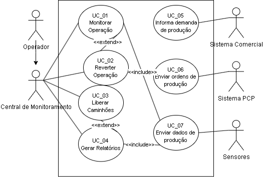

## 📝 Casos de Uso Detalhados

Abaixo, detalhamos cada caso de uso, mostrando o fluxo principal, fluxos alternativos, pré-condições e pós-condições.

### UC_01 - Monitorar Operação

Clique para expandir

### UC_02 - Reverter Operação

Clique para expandir

### UC_03 - Liberar Caminhões

Clique para expandir

### UC_04 - Gerar Relatórios

Clique para expandir

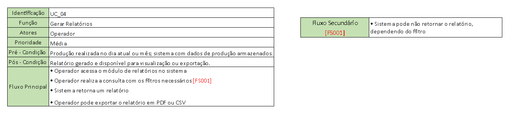

### UC_05 - Informar demanda de Produção

Clique para expandir

### UC_06 - UC_06 - Enviar ordens de produção

Clique para expandir

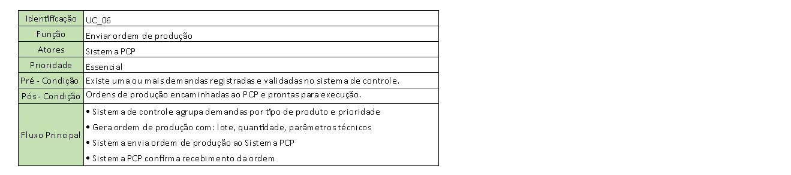

### UC_07 - Enviar dados de produção

Clique para expandir

## 🧮 Diagrama de Classes

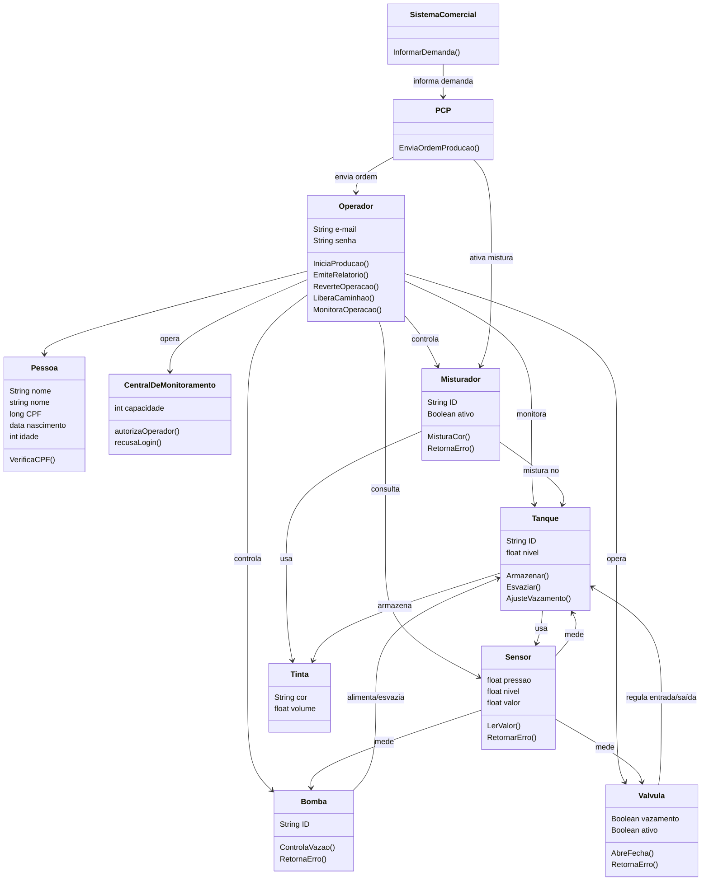
``` mermaid

classDiagram

    Operador --> Pessoa
    Operador --> CentralDeMonitoramento : opera

    Operador --> Misturador : controla
    Operador --> Tanque : monitora
    Operador --> Valvula : opera
    Operador --> Bomba : controla
    Operador --> Sensor : consulta

    Misturador --> Tanque : mistura no
    Misturador --> Tinta : usa

    Tanque --> Tinta : armazena
    Tanque --> Sensor : usa

    Bomba --> Tanque : alimenta/esvazia
    Valvula --> Tanque : regula entrada/saída

    Sensor --> Tanque : mede
    Sensor --> Bomba : mede
    Sensor --> Valvula : mede

    PCP --> Operador : envia ordem
    PCP --> Misturador : ativa mistura

    SistemaComercial --> PCP : informa demanda

    class Pessoa {
        String nome
        string nome
        long CPF
        data nascimento
        int idade
        VerificaCPF()
    }

    class Operador{
        String e-mail
        String senha
        IniciaProducao()
        EmiteRelatorio()
        ReverteOperacao()
        LiberaCaminhao()
        MonitoraOperacao()
    }

    class CentralDeMonitoramento{
        int capacidade
        autorizaOperador()
        recusaLogin()
    }

    class Misturador {
        String ID
        Boolean ativo
        MisturaCor()
        RetornaErro()
    }

    class Bomba {
        String ID
        ControlaVazao()
        RetornaErro()
    }

    class Valvula {
        Boolean vazamento
        Boolean ativo
        AbreFecha()
        RetornaErro()

    }

    class Tanque {
        String ID
        float nivel
        Armazenar()
        Esvaziar()
        AjusteVazamento()
    }

    class Sensor {
        float pressao
        float nivel
        float valor
        LerValor()
        RetornarErro()
    }

    class Tinta {
        String cor
        float volume
    }

    class PCP {
        EnviaOrdemProducao()
    }

    class SistemaComercial {
        InformarDemanda()
    }

```

## 📌 Diagrama de Sequência

1. Monitorar Operação
2. Reverter Operação
3. Liberar Caminhões
4. Gerar Relatórios
5. Informar Demanda de Produção
6. Enviar ordens de produção
7. Enviar dados de produção

### 1️⃣ Operador que Monitorar Operação

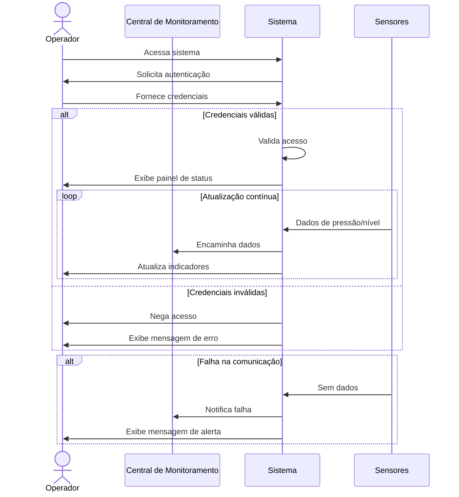
```mermaid
sequenceDiagram


actor Operador
participant Central de Monitoramento
participant Sistema
participant Sensores

Operador->>Sistema: Acessa sistema
Sistema->>Operador: Solicita autenticação
Operador->>Sistema: Fornece credenciais

alt Credenciais válidas
    Sistema->>Sistema: Valida acesso
    Sistema->>Operador: Exibe painel de status

    loop Atualização contínua
        Sensores->>Sistema: Dados de pressão/nível
        Sistema->>Central de Monitoramento: Encaminha dados
        Sistema->>Operador: Atualiza indicadores
    end
else Credenciais inválidas 
    Sistema->>Operador: Nega acesso
    Sistema->>Operador: Exibe mensagem de erro
end

alt Falha na comunicação 
    Sensores->>Sistema: Sem dados
    Sistema->>Central de Monitoramento: Notifica falha
    Sistema->>Operador: Exibe mensagem de alerta
end
```
### 2️⃣ Reverter Operação

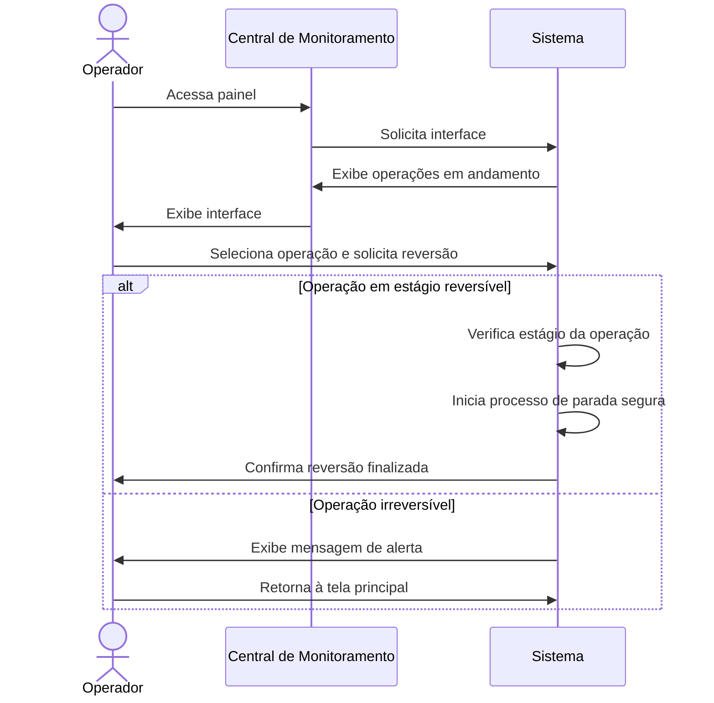
```mermaid
sequenceDiagram
    
    actor Operador
    participant Central de Monitoramento
    participant Sistema

    Operador->>Central de Monitoramento: Acessa painel
    Central de Monitoramento->>Sistema: Solicita interface
    Sistema->>Central de Monitoramento: Exibe operações em andamento
    Central de Monitoramento->>Operador: Exibe interface

    Operador->>Sistema: Seleciona operação e solicita reversão

    alt Operação em estágio reversível
        Sistema->>Sistema: Verifica estágio da operação
        Sistema->>Sistema: Inicia processo de parada segura
        Sistema->>Operador: Confirma reversão finalizada
    else Operação irreversível
        Sistema->>Operador: Exibe mensagem de alerta
        Operador->>Sistema: Retorna à tela principal
    end
```
### 3️⃣ Liberar Caminhões

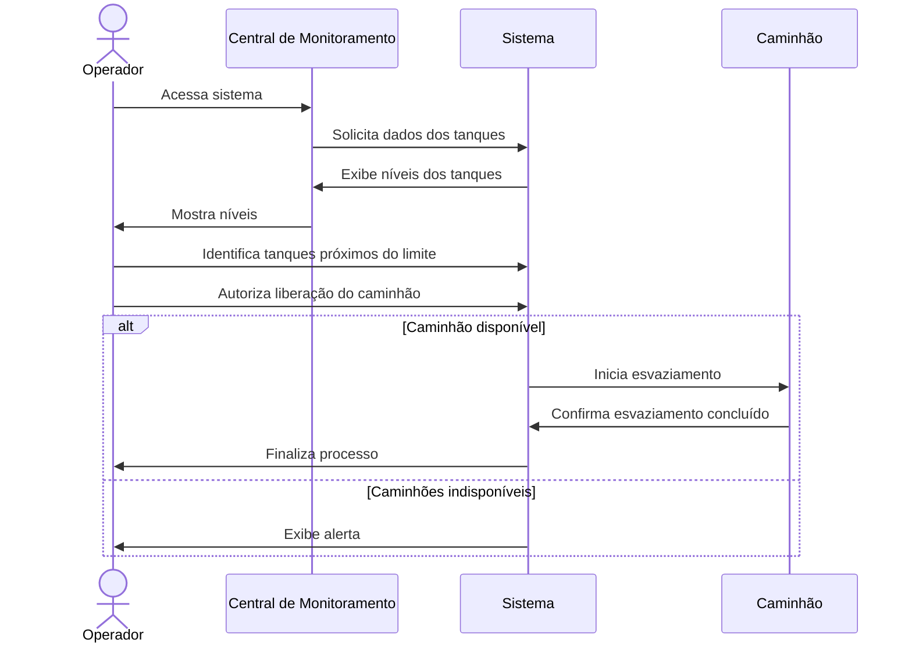
```mermaid
sequenceDiagram
   actor Operador
    participant Central de Monitoramento
    participant Sistema
    participant Caminhão

    Operador->>Central de Monitoramento: Acessa sistema
    Central de Monitoramento->>Sistema: Solicita dados dos tanques
    Sistema->>Central de Monitoramento: Exibe níveis dos tanques
    Central de Monitoramento->>Operador: Mostra níveis

    Operador->>Sistema: Identifica tanques próximos do limite
    Operador->>Sistema: Autoriza liberação do caminhão

    alt Caminhão disponível
        Sistema->>Caminhão: Inicia esvaziamento
        Caminhão->>Sistema: Confirma esvaziamento concluído
        Sistema->>Operador: Finaliza processo
    else Caminhões indisponíveis
        Sistema->>Operador: Exibe alerta
    end

```
### 4️⃣ Gerar Relatório

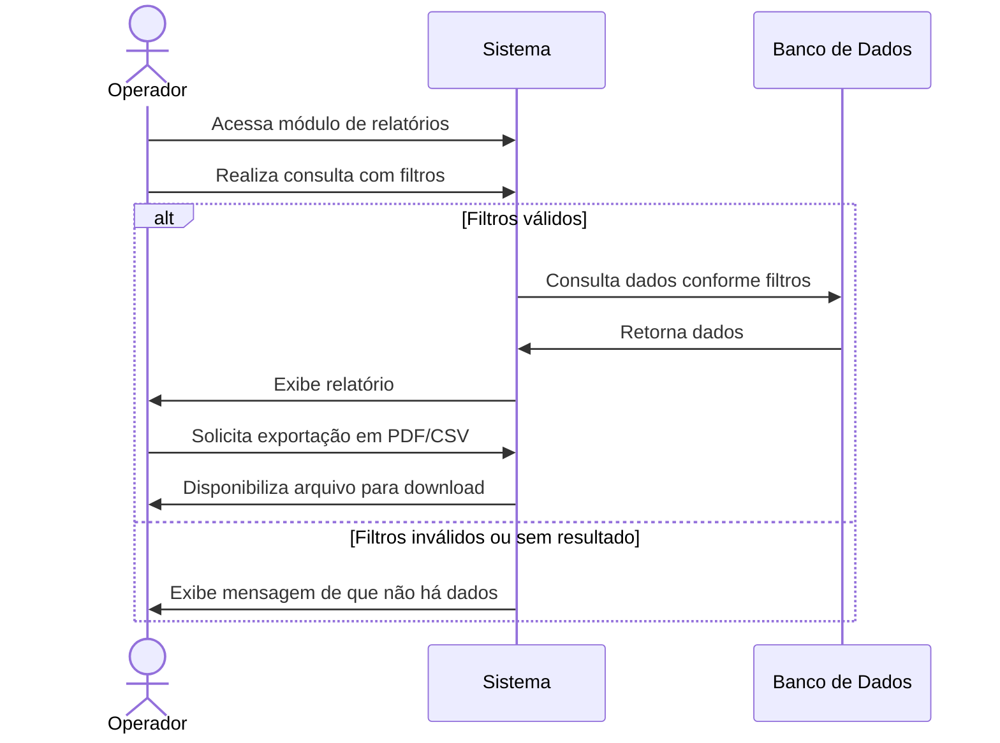
```mermaid
sequenceDiagram

    actor Operador
    participant Sistema
    participant Banco de Dados

    Operador->>Sistema: Acessa módulo de relatórios
    Operador->>Sistema: Realiza consulta com filtros

    alt Filtros válidos
        Sistema->>Banco de Dados: Consulta dados conforme filtros
        Banco de Dados->>Sistema: Retorna dados
        Sistema->>Operador: Exibe relatório
        Operador->>Sistema: Solicita exportação em PDF/CSV
        Sistema->>Operador: Disponibiliza arquivo para download
    else Filtros inválidos ou sem resultado
        Sistema->>Operador: Exibe mensagem de que não há dados
    end

```

### 5️⃣ Informar Demanda de Produção
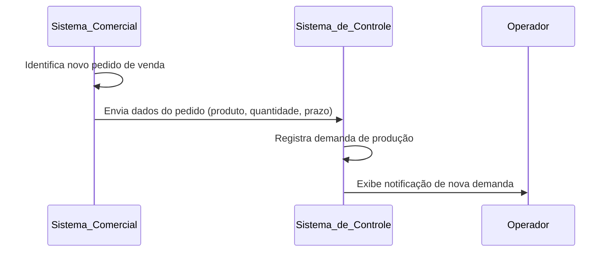
```mermaid
sequenceDiagram

    participant Sistema_Comercial
    participant Sistema_de_Controle
    participant Operador

    Sistema_Comercial->>Sistema_Comercial: Identifica novo pedido de venda
    Sistema_Comercial->>Sistema_de_Controle: Envia dados do pedido (produto, quantidade, prazo)
    Sistema_de_Controle->>Sistema_de_Controle: Registra demanda de produção
    Sistema_de_Controle->>Operador: Exibe notificação de nova demanda

```
### 6️⃣ Enviar Ordens de Produção
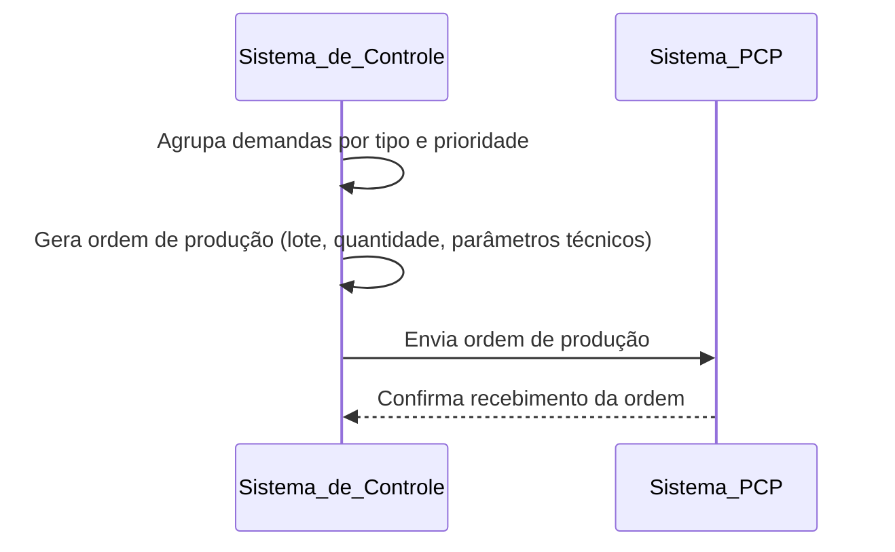
```mermaid
sequenceDiagram

    participant Sistema_de_Controle
    participant Sistema_PCP

    Sistema_de_Controle->>Sistema_de_Controle: Agrupa demandas por tipo e prioridade
    Sistema_de_Controle->>Sistema_de_Controle: Gera ordem de produção (lote, quantidade, parâmetros técnicos)
    Sistema_de_Controle->>Sistema_PCP: Envia ordem de produção
    Sistema_PCP-->>Sistema_de_Controle: Confirma recebimento da ordem

```
### 7️⃣ Enviar Dados de Produção
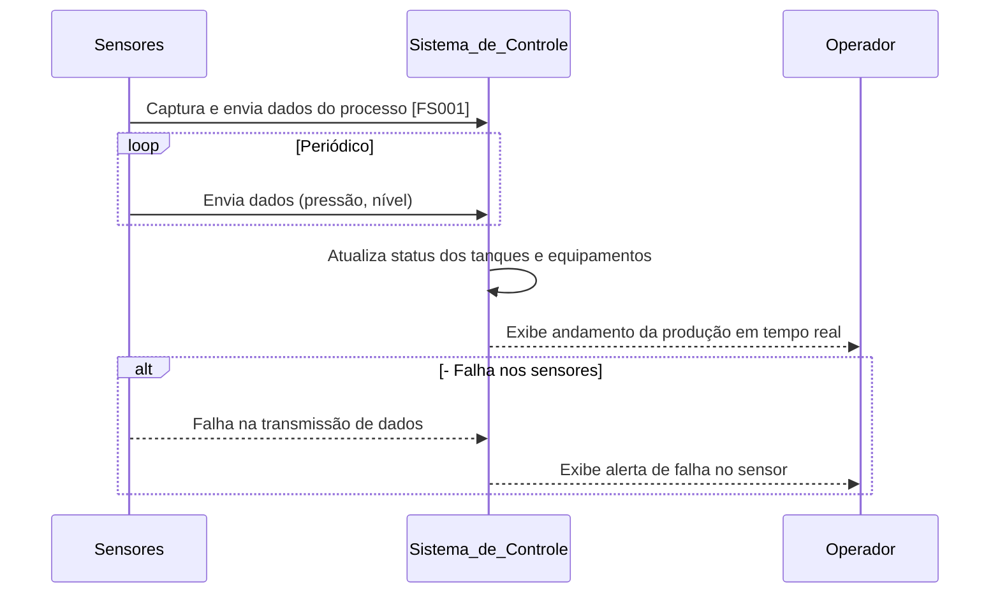
```mermaid

sequenceDiagram

    participant Sensores
    participant Sistema_de_Controle
    participant Operador

    Sensores->>Sistema_de_Controle: Captura e envia dados do processo [FS001]
    loop Periódico
        Sensores->>Sistema_de_Controle: Envia dados (pressão, nível)
    end
    Sistema_de_Controle->>Sistema_de_Controle: Atualiza status dos tanques e equipamentos
    Sistema_de_Controle-->>Operador: Exibe andamento da produção em tempo real

    alt - Falha nos sensores
        Sensores-->>Sistema_de_Controle: Falha na transmissão de dados
        Sistema_de_Controle-->>Operador: Exibe alerta de falha no sensor
    end


```

## 📈 Diagrama de Estados

### 1️⃣ Operador
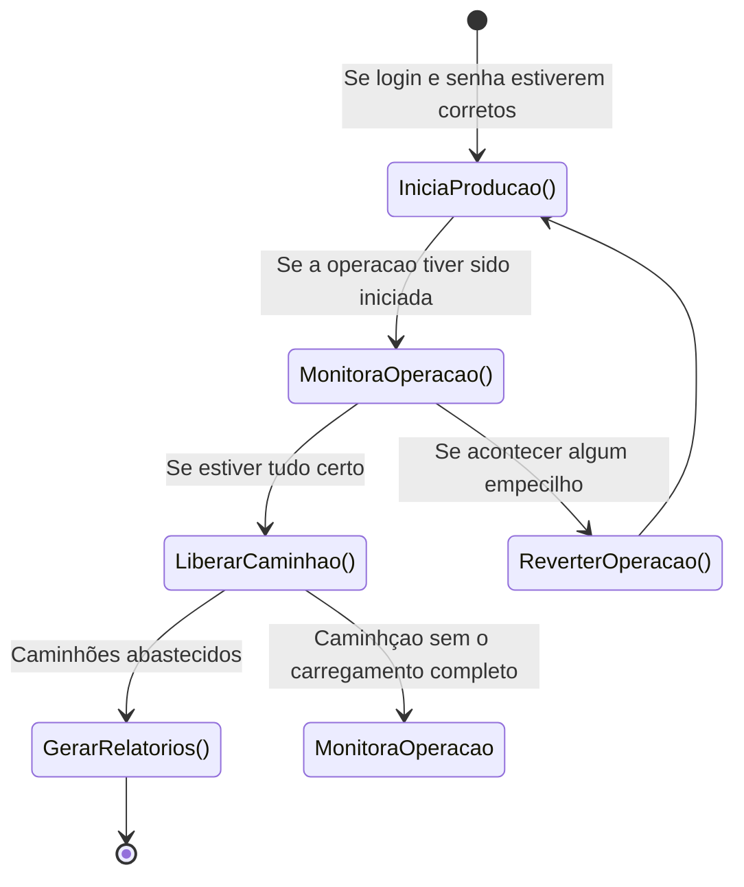
```mermaid
stateDiagram
    [*] --> IniciaProducao() : Se login e senha estiverem corretos
    IniciaProducao() --> MonitoraOperacao() : Se a operacao tiver sido iniciada
    MonitoraOperacao() --> LiberarCaminhao() : Se estiver tudo certo
    MonitoraOperacao() --> ReverterOperacao() : Se acontecer algum empecilho
    ReverterOperacao() --> IniciaProducao()
    LiberarCaminhao() --> GerarRelatorios() : Caminhões abastecidos
    LiberarCaminhao() -->  MonitoraOperacao : Caminhçao sem o carregamento completo
    GerarRelatorios() --> [*]
```

### 2️⃣ Central de Monitoramento
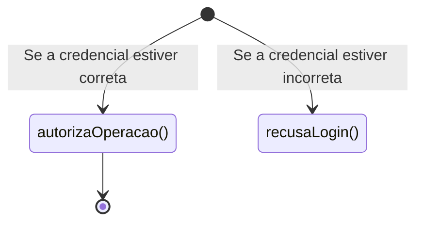
```mermaid
stateDiagram
    [*] --> autorizaOperacao() : Se a credencial estiver correta
    [*] --> recusaLogin() : Se a credencial estiver incorreta
    autorizaOperacao() --> [*]
    
```

### 3️⃣ Misturador

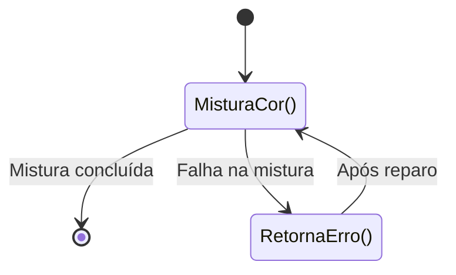
```mermaid
stateDiagram
    [*] --> MisturaCor()
    MisturaCor() --> [*] : Mistura concluída
    MisturaCor() --> RetornaErro() : Falha na mistura
    RetornaErro() --> MisturaCor() : Após reparo
    
```

### 4️⃣ Sistema Comercial
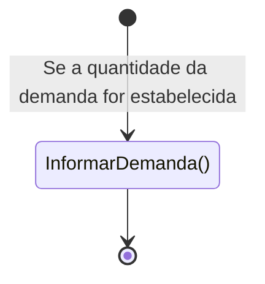
```mermaid
stateDiagram
    [*] --> InformarDemanda() : Se a quantidade da demanda for estabelecida
    InformarDemanda() --> [*]

``` 

### 5️⃣ Bomba
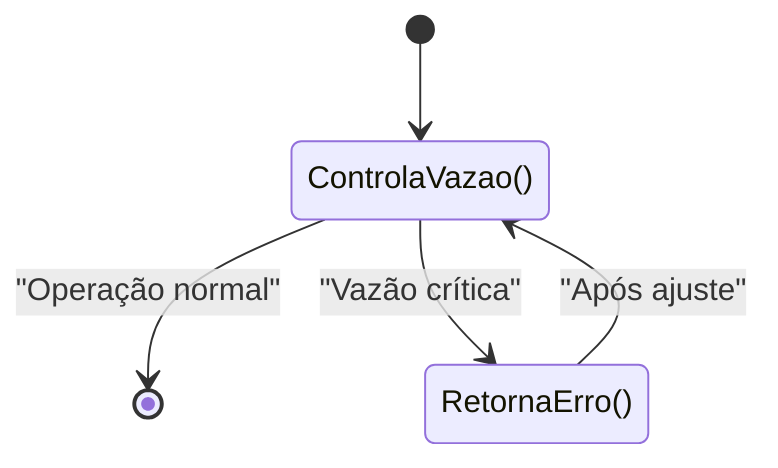
```mermaid
stateDiagram
    [*] --> ControlaVazao()
    ControlaVazao() --> [*] : "Operação normal"
    ControlaVazao() --> RetornaErro() : "Vazão crítica"
    RetornaErro() --> ControlaVazao() : "Após ajuste"
```

### 6️⃣ Válvula
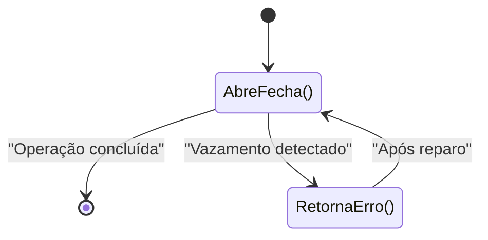
```mermaid
stateDiagram
    [*] --> AbreFecha()
    AbreFecha() --> [*] : "Operação concluída"
    AbreFecha() --> RetornaErro() : "Vazamento detectado"
    RetornaErro() --> AbreFecha() : "Após reparo"
```

### 7️⃣ Tanque
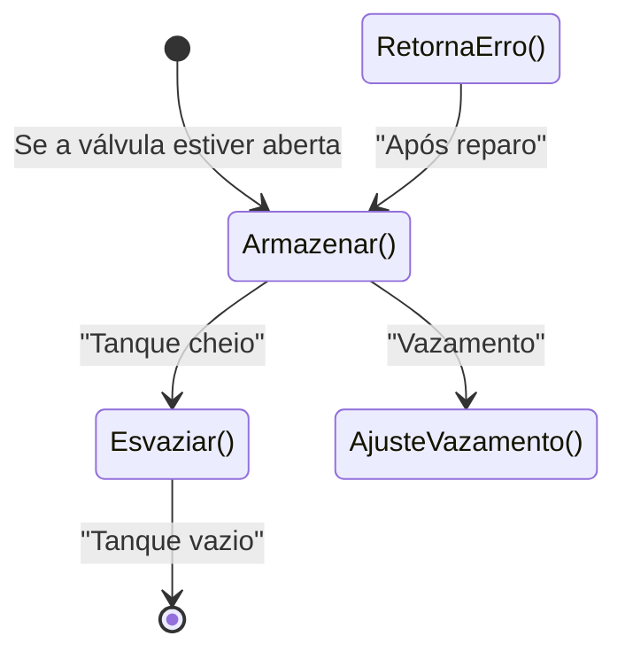
```mermaid
stateDiagram
    [*] --> Armazenar() : Se a válvula estiver aberta
    Armazenar() --> Esvaziar() : "Tanque cheio"
    Esvaziar() --> [*] : "Tanque vazio"
    Armazenar() --> AjusteVazamento() : "Vazamento"
    RetornaErro() --> Armazenar() : "Após reparo"
```

### 8️⃣ PCP

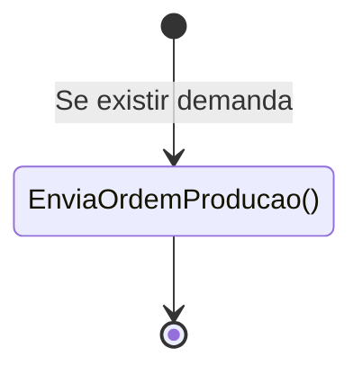
```mermaid
stateDiagram
    [*] --> EnviaOrdemProducao() : Se existir demanda
    EnviaOrdemProducao() --> [*]
```

### 8️⃣ PCP

```mermaid
stateDiagram
    [*] --> EnviaOrdemProducao() : Se existir demanda
    EnviaOrdemProducao() --> [*]
```
### 9️⃣ Sensor

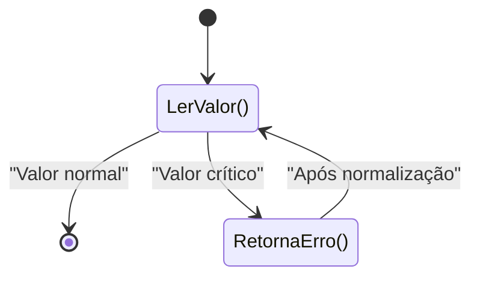
```mermaid
stateDiagram
    [*] --> LerValor()
    LerValor() --> [*] : "Valor normal"
    LerValor() --> RetornaErro() : "Valor crítico"
    RetornaErro() --> LerValor() : "Após normalização"
```
## 🎱 Diagramas de Atividades
### Liberação de Caminhões
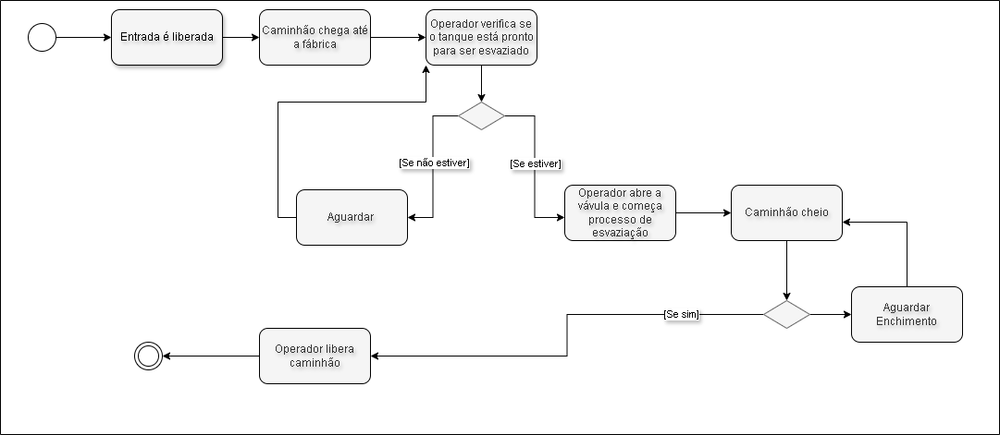

### Produção de Tinta
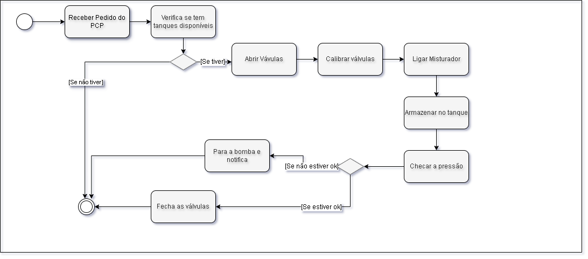

## 🖥️ Diagramas de Componentes e Integração
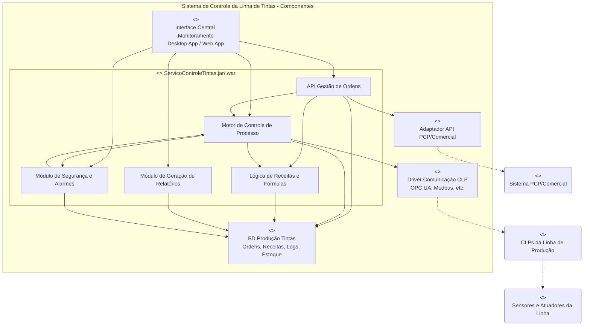
```mermaid
graph TD
    subgraph "Sistema de Controle da Linha de Tintas - Componentes"
        %% Aplicações de Interface
        CentralMonitoramento_UI[<<application>><br>Interface Central Monitoramento<br>Desktop App / Web App]

        %% Núcleo do Sistema de Controle (Backend)
        subgraph "<<service>> ServicoControleTintas.jar/.war"
            direction LR
            APIGestaoOrdens[API Gestão de Ordens]
            MotorControleProcesso[Motor de Controle de Processo]
            LogicaReceitasFormulas[Lógica de Receitas e Fórmulas]
            ModuloRelatorios[Módulo de Geração de Relatórios]
            ModuloSegurancaAlarmes[Módulo de Segurança e Alarmes]
        end

        %% Componentes de Integração e Drivers
        IntegracaoPCP_Comercial[<<component>><br>Adaptador API PCP/Comercial]
        DriverComunicacaoCLP[<<component>><br>Driver Comunicação CLP<br>OPC UA, Modbus, etc.]

        %% Persistência
        BancoDeDadosProducao[<<database>><br>BD Produção Tintas<br>Ordens, Receitas, Logs, Estoque]

        %% Dependências Internas
        CentralMonitoramento_UI --> APIGestaoOrdens
        CentralMonitoramento_UI --> MotorControleProcesso
        %% Para comandos manuais e visualização
        CentralMonitoramento_UI --> ModuloRelatorios
        CentralMonitoramento_UI --> ModuloSegurancaAlarmes

        APIGestaoOrdens --> LogicaReceitasFormulas
        APIGestaoOrdens --> MotorControleProcesso
        APIGestaoOrdens --> BancoDeDadosProducao

        MotorControleProcesso --> LogicaReceitasFormulas
        MotorControleProcesso --> DriverComunicacaoCLP
        %% Comanda os CLPs
        MotorControleProcesso --> ModuloSegurancaAlarmes
        MotorControleProcesso --> BancoDeDadosProducao
        %% Para log de eventos de processo

        LogicaReceitasFormulas --> BancoDeDadosProducao
        ModuloRelatorios --> BancoDeDadosProducao
        ModuloSegurancaAlarmes --> BancoDeDadosProducao
        ModuloSegurancaAlarmes --> MotorControleProcesso
        %% Pode enviar comandos de parada

        %% Dependências com Interfaces Externas
        APIGestaoOrdens --> IntegracaoPCP_Comercial
        %% Para receber ordens e talvez enviar status

    end

    %% Sistemas Externos
    CLPs_LinhaProducao("<<hardware>><br>CLPs da Linha de Produção")
    SistemaPCP_Externo("<<external_system>><br>Sistema PCP/Comercial")
    SensoresAtuadores("<<hardware>><br>Sensores e Atuadores da Linha")

    %% Conexões com Sistemas Externos
    DriverComunicacaoCLP -.-> CLPs_LinhaProducao
    IntegracaoPCP_Comercial -.-> SistemaPCP_Externo
    CLPs_LinhaProducao -.-> SensoresAtuadores
    %% CLPs leem sensores e comandam atuadores
```
## 🛠️ Tecnologias

*   **Diagramas:** 
*   **Diagramas de Caso de Uso:** 
*   **Diagramas de Classes:** 
*   **Diagrama de Sequência:** 

---

## 🤝 Contribuições
Contribuições para aprimorar este projeto são muito bem-vindas, forke o projeto e contribua!

## ✉️ Contato
Qualquer dúvida sobre o projeto entrar em contato, será um prazer!
